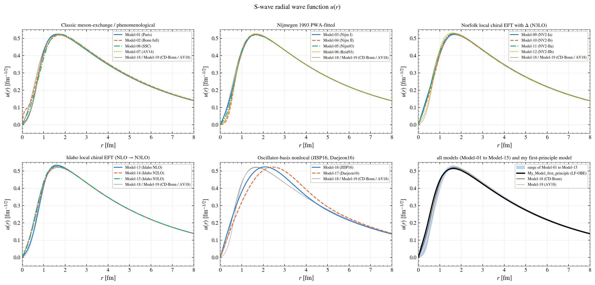
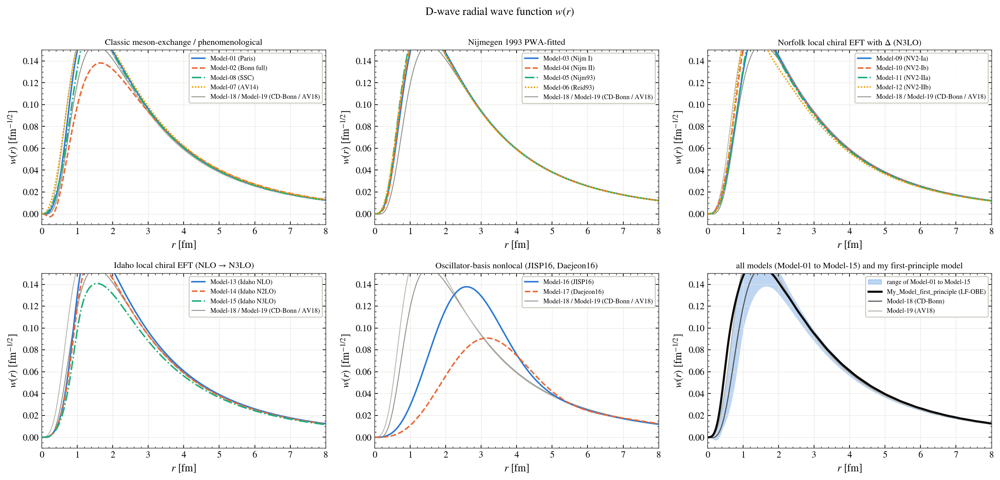
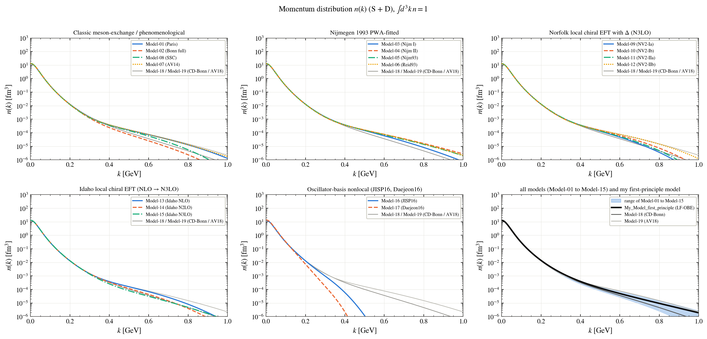
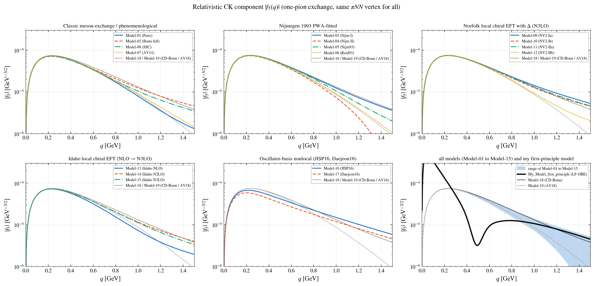

# Wave functions

Every figure shows the models family by family; the last panel shows the range of Model-01 to Model-15, the two reference models (Model-18, Model-19) and **My_Model_first_principle** (black). The names of the models are in the [main README](../../README.md#the-models).

**S-wave radial wave function u(r)**

**D-wave radial wave function w(r)**

**Momentum distribution n(k)**

**The relativistic light-front component f5**

