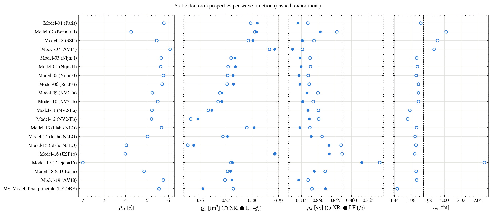

# Static properties and agreement with data

Every figure shows the models family by family; the last panel shows the range of Model-01 to Model-15, the two reference models (Model-18, Model-19) and **My_Model_first_principle** (black). The names of the models are in the [main README](../../README.md#the-models).

**D-state probability, quadrupole moment, magnetic moment and matter radius against experiment**

**Χ²/N against every elastic and DIS data set (lower is better)**

