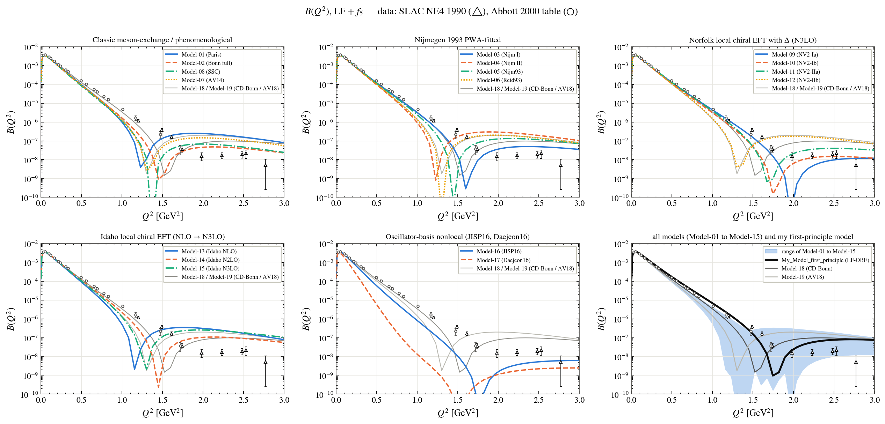
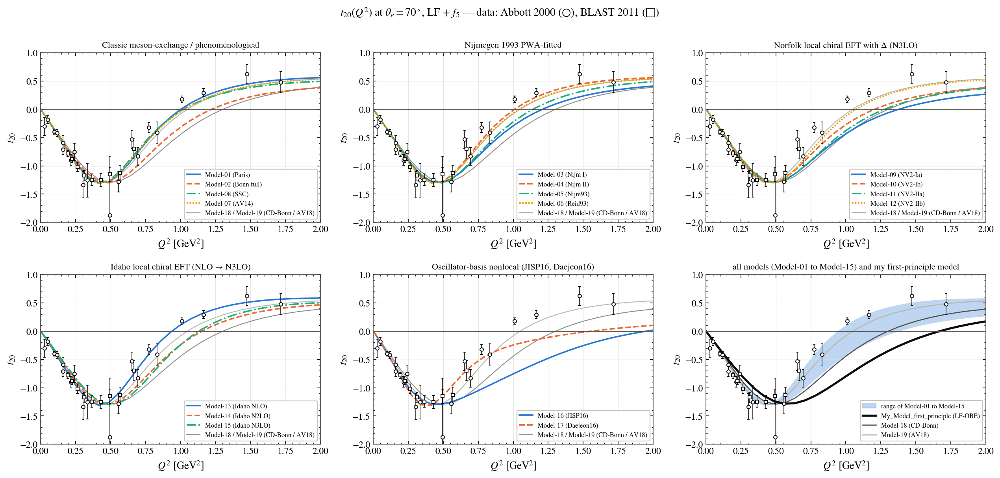
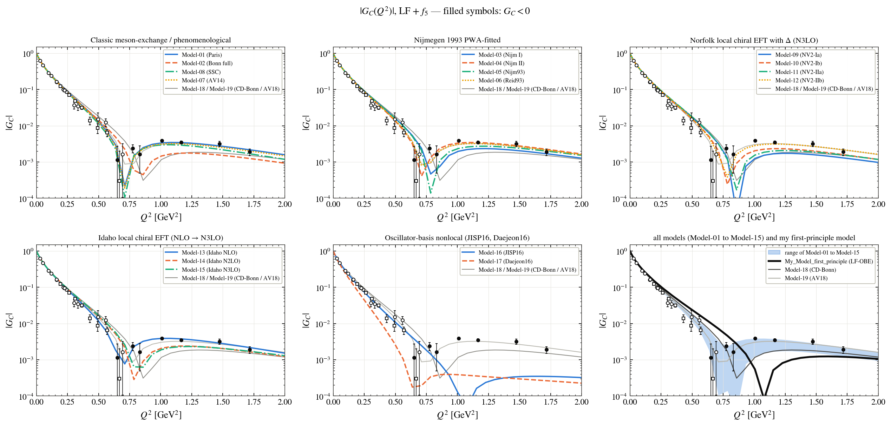
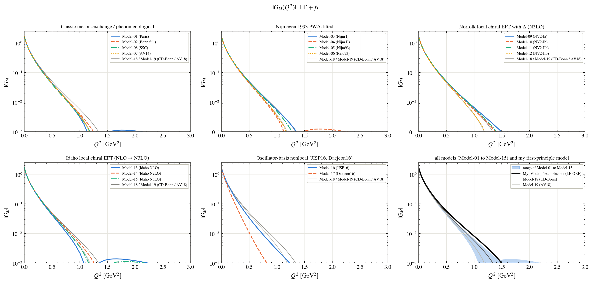
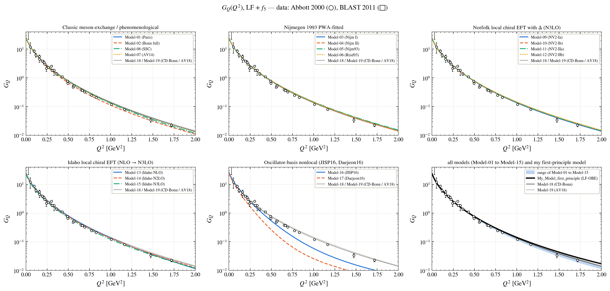

# Elastic electron–deuteron scattering

Every figure shows the models family by family; the last panel shows the range of Model-01 to Model-15, the two reference models (Model-18, Model-19) and **My_Model_first_principle** (black). The names of the models are in the [main README](../../README.md#the-models).

**Structure function A(Q²) against JLab Hall C**

**Structure function B(Q²) against SLAC**

**Tensor polarisation t20 at 70° against Abbott 2000 and BLAST**

**Charge form factor G_C**

**Magnetic form factor G_M**

**Quadrupole form factor G_Q**

