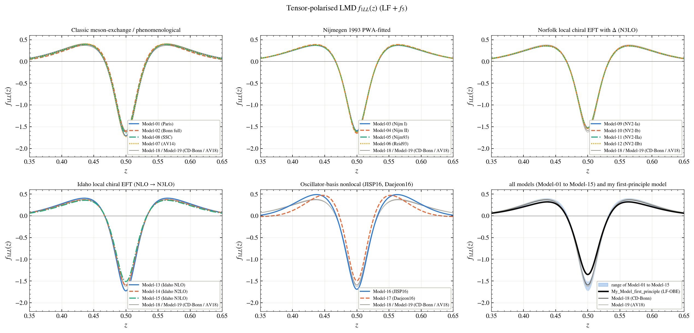
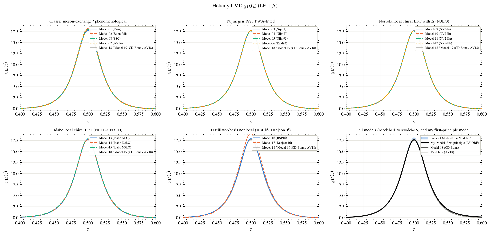

# Nucleon momentum distributions in the deuteron

Every figure shows the models family by family; the last panel shows the range of Model-01 to Model-15, the two reference models (Model-18, Model-19) and **My_Model_first_principle** (black). The names of the models are in the [main README](../../README.md#the-models).

**Tensor-polarised nucleon distribution f1LL(z)**

**Nucleon helicity distribution g1L(z)**

