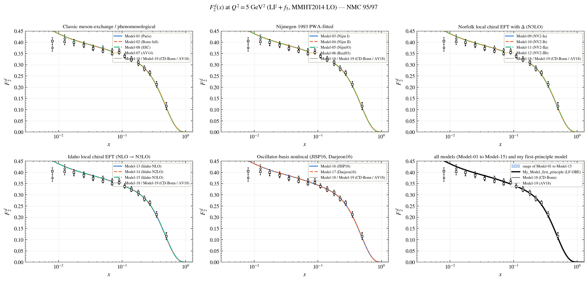
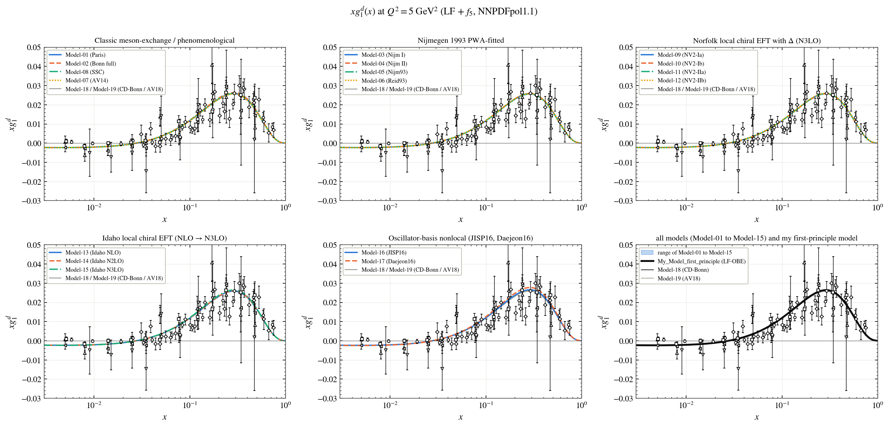
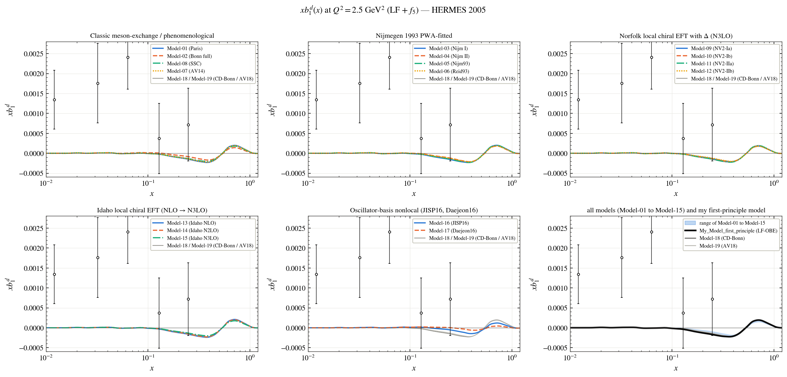
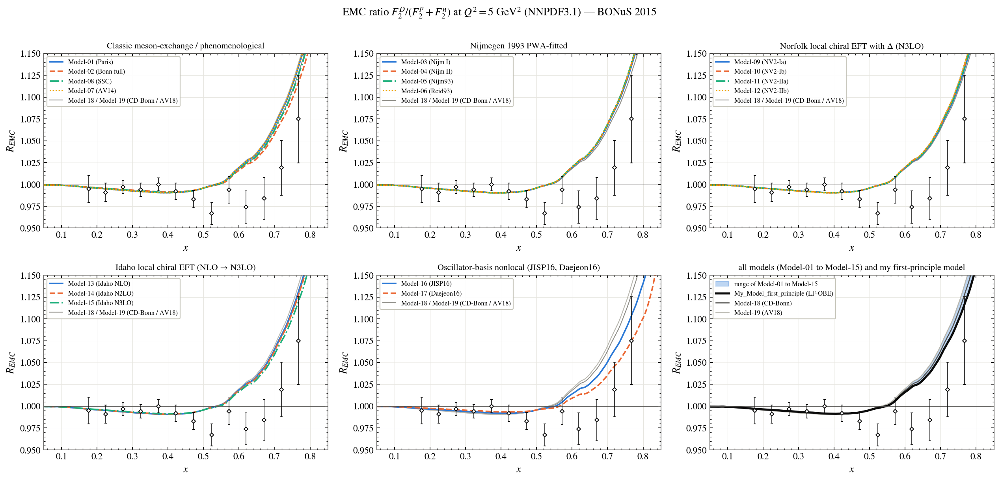

# Deep inelastic structure functions

Every figure shows the models family by family; the last panel shows the range of Model-01 to Model-15, the two reference models (Model-18, Model-19) and **My_Model_first_principle** (black). The names of the models are in the [main README](../../README.md#the-models).

**F2 of the deuteron against NMC**

**X g1 of the deuteron against SMC, E143, HERMES, COMPASS**

**X b1 of the deuteron against HERMES**

**EMC ratio F2^d/(F2^p + F2^n) against BONuS**

