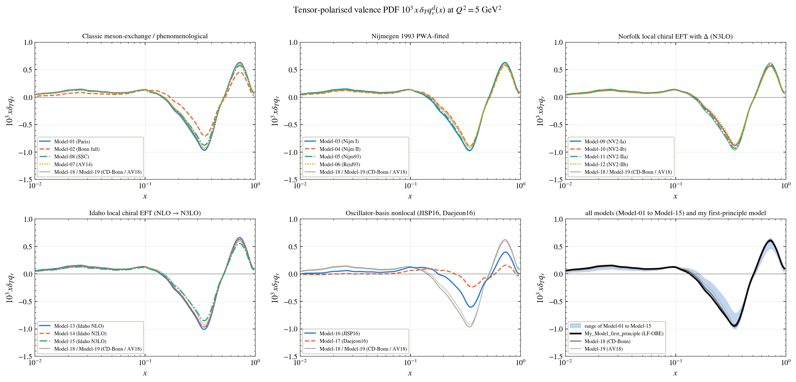
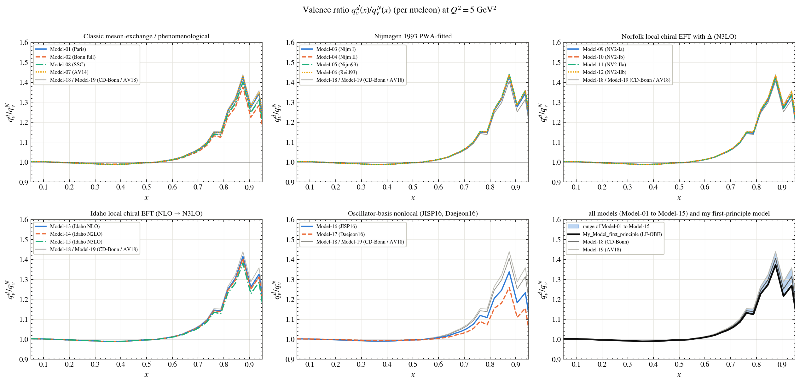
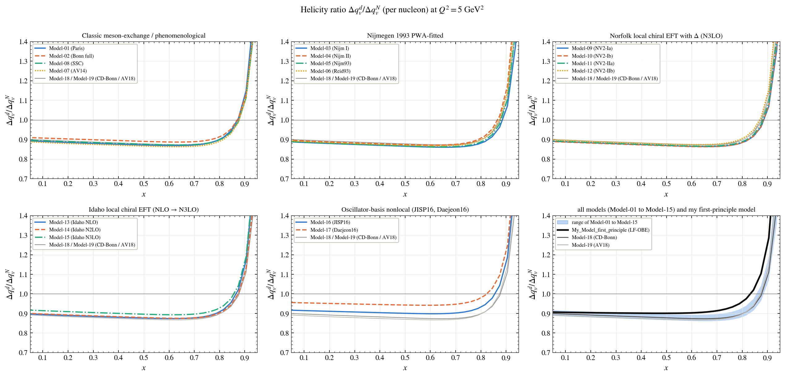
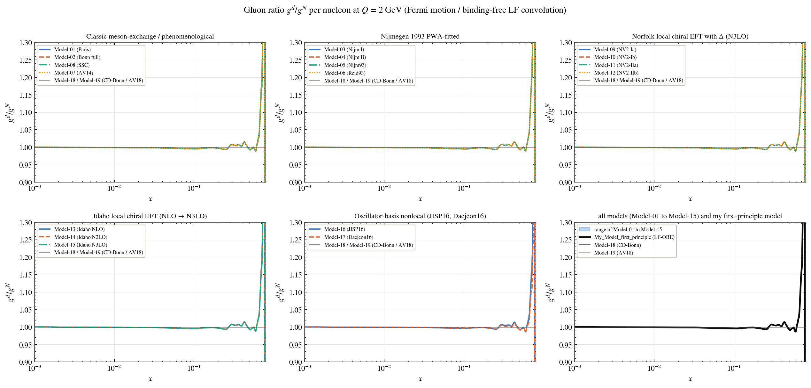
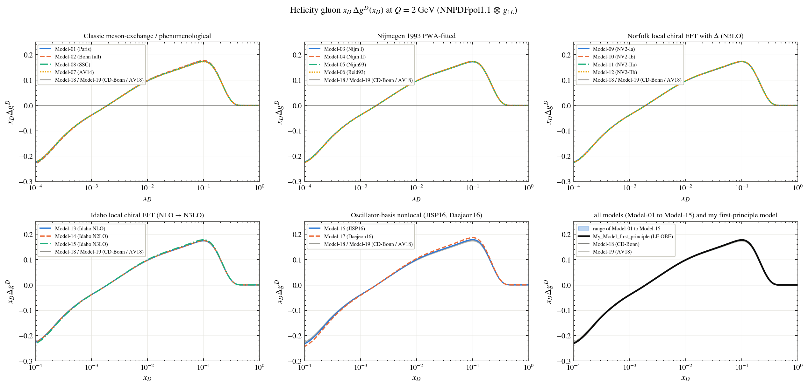

# Parton distributions

Every figure shows the models family by family; the last panel shows the range of Model-01 to Model-15, the two reference models (Model-18, Model-19) and **My_Model_first_principle** (black). The names of the models are in the [main README](../../README.md#the-models).

**Tensor-polarised valence quark distribution**

**Valence quarks: deuteron over free nucleon**

**Quark helicity: deuteron over free nucleon**

**Gluons: deuteron over free nucleon at Q = 2 GeV**

**Gluon helicity distribution of the deuteron at Q = 2 GeV**

