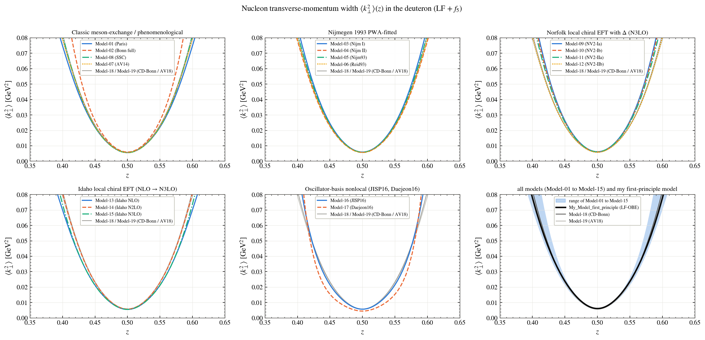
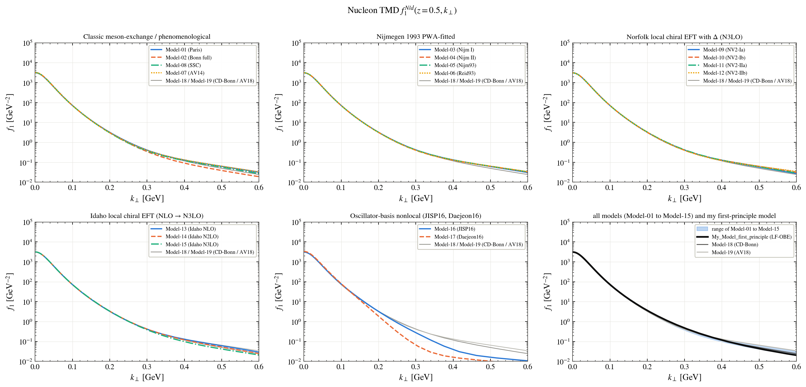
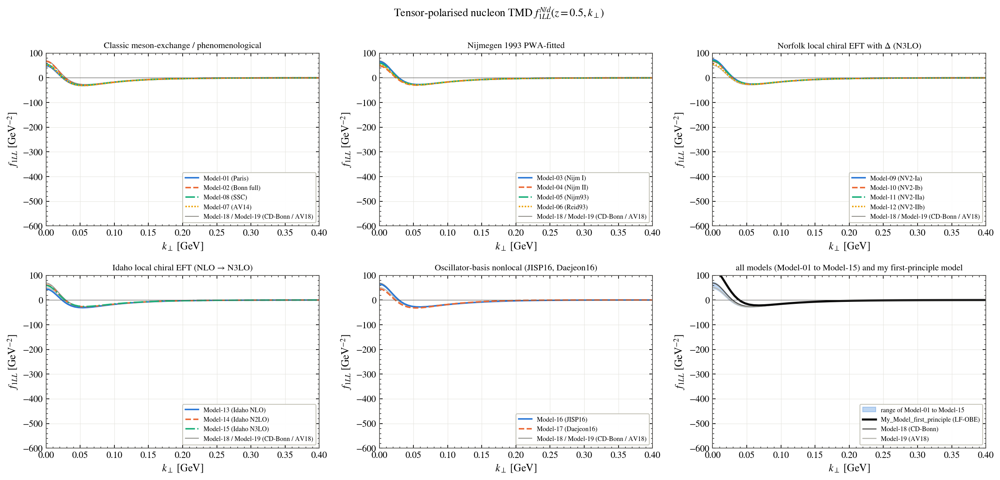
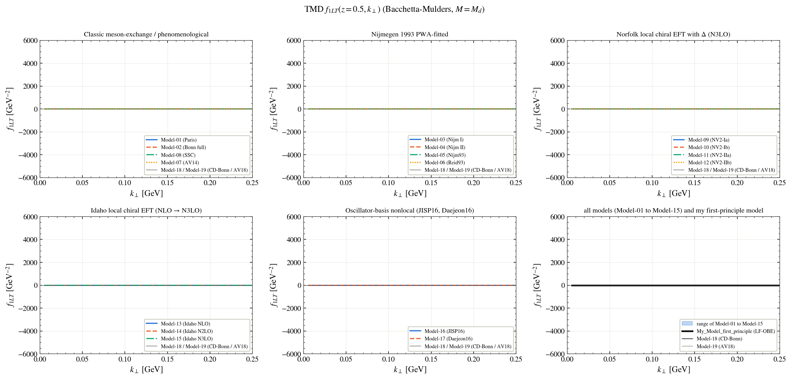
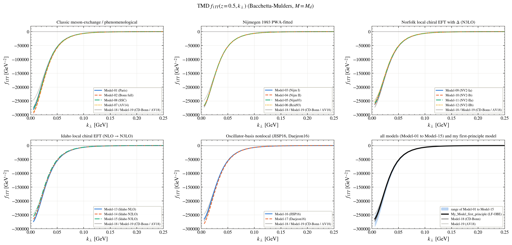
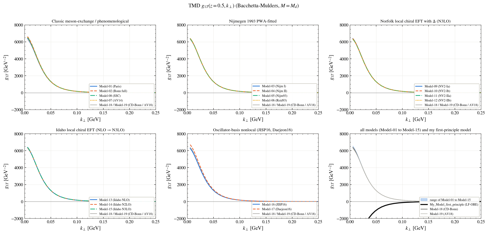
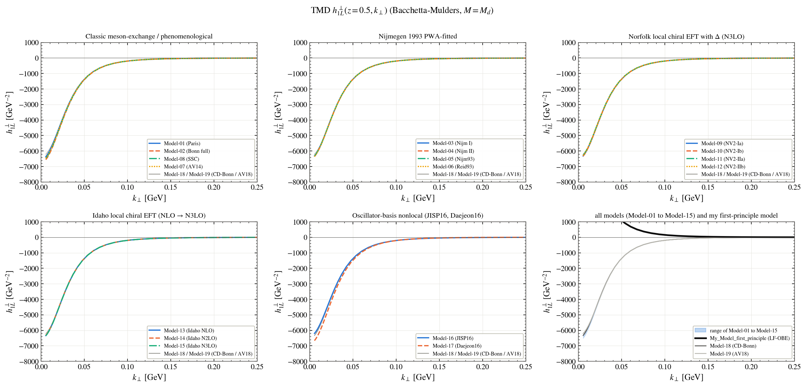
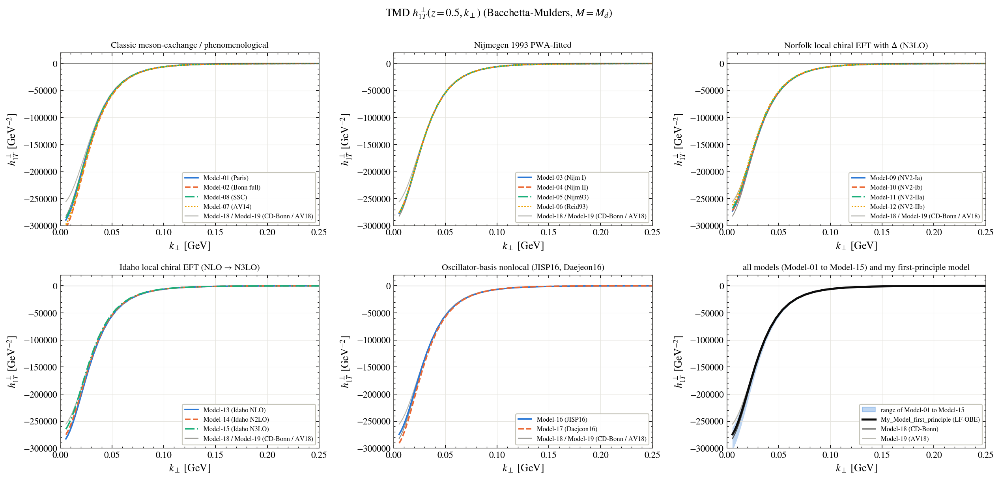
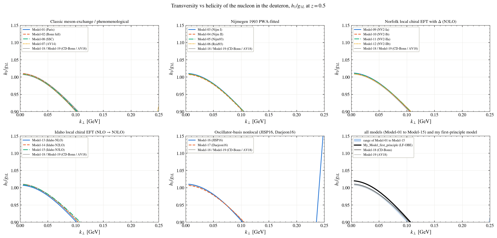
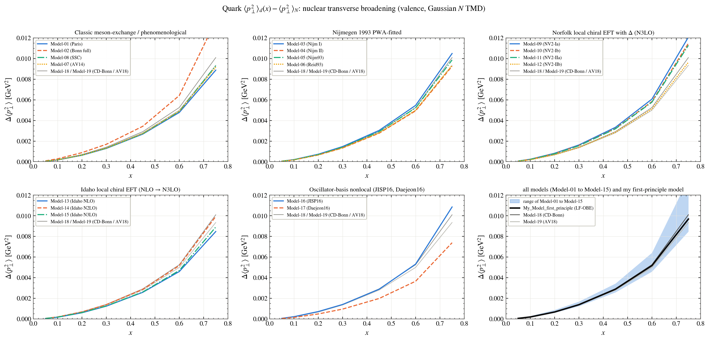

# Transverse-momentum distributions (TMDs)

Every figure shows the models family by family; the last panel shows the range of Model-01 to Model-15, the two reference models (Model-18, Model-19) and **My_Model_first_principle** (black). The names of the models are in the [main README](../../README.md#the-models).

**Mean transverse momentum squared of the nucleon against z**

**Unpolarised TMD f1 at z = 0.5**

**Tensor-polarised TMD f1LL at z = 0.5**

**Tensor-polarised TMD f1LT**

**Tensor-polarised TMD f1TT**

**Worm-gear TMD g1T**

**Worm-gear TMD h1L⊥**

**Pretzelosity h1T⊥**

**Transversity over helicity, h1/g1L**

**Transverse-momentum broadening of the quarks**

