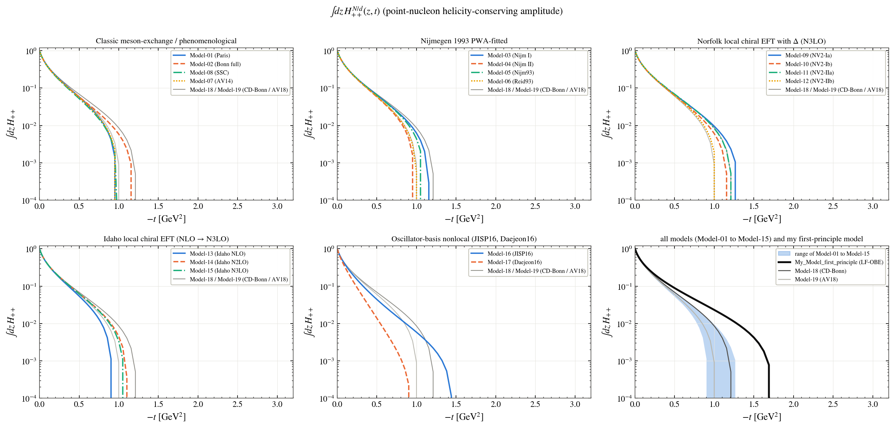
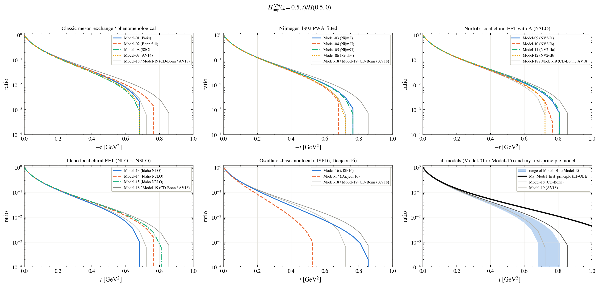
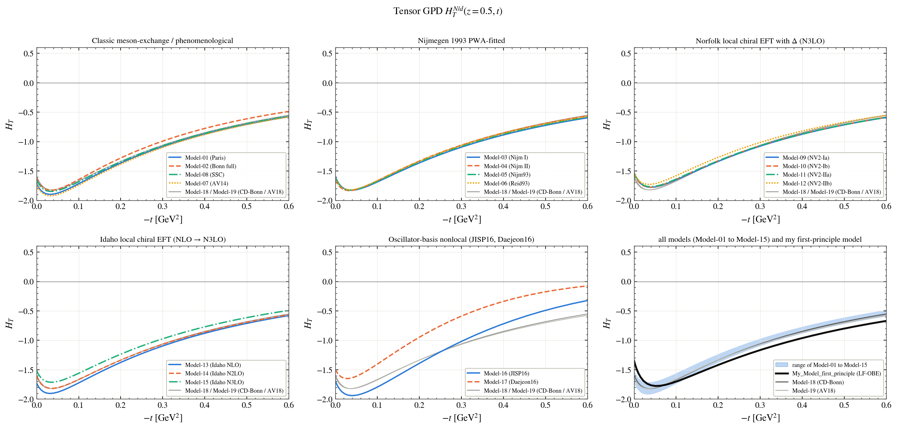
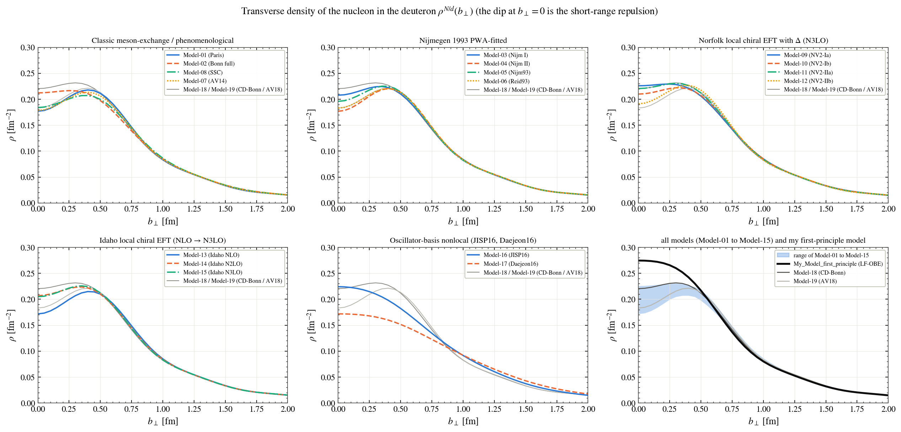
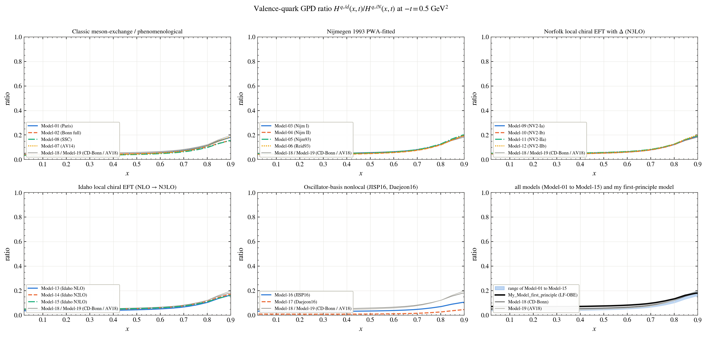
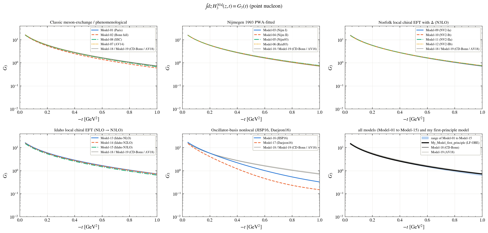
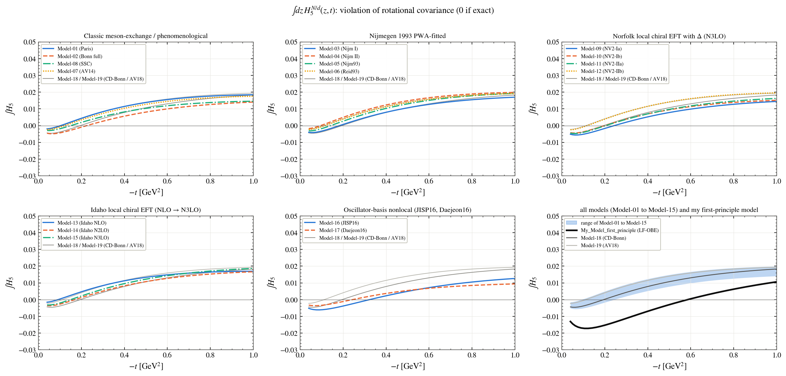

# Generalised parton distributions (GPDs)

Every figure shows the models family by family; the last panel shows the range of Model-01 to Model-15, the two reference models (Model-18, Model-19) and **My_Model_first_principle** (black). The names of the models are in the [main README](../../README.md#the-models).

**Z-integrated GPD H++(t)**

**Unpolarised GPD at z = 0.5**

**Tensor-polarised GPD at z = 0.5**

**Transverse density of the nucleon in the deuteron**

**Quark GPD of the deuteron over the free nucleon**

**Z-integral of the GPD H3**

**Z-integral of H5, a test of rotational covariance (zero for an exact current)**

