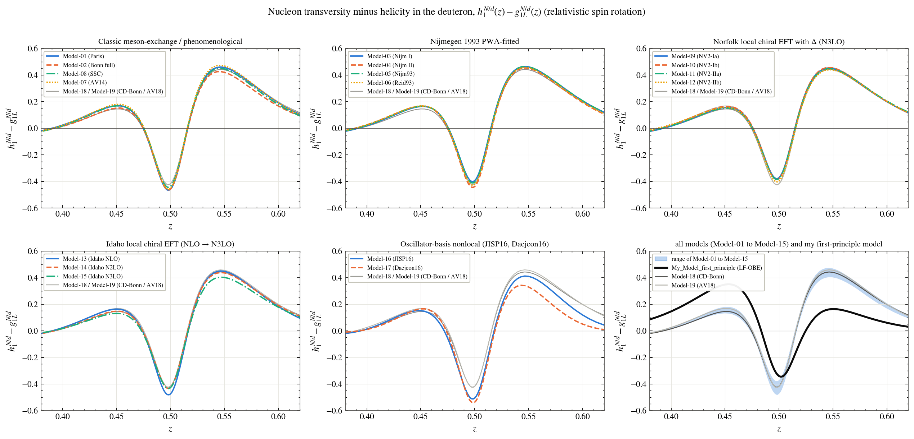
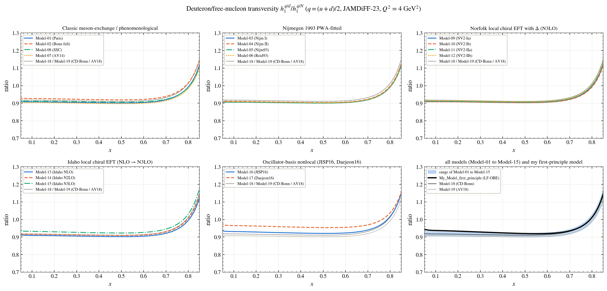

# Transversity and tensor charge

Every figure shows the models family by family; the last panel shows the range of Model-01 to Model-15, the two reference models (Model-18, Model-19) and **My_Model_first_principle** (black). The names of the models are in the [main README](../../README.md#the-models).

**Nucleon transversity minus helicity in the deuteron**

**Quark transversity: deuteron over free nucleon**

**Tensor charge per nucleon against Q² (QCD evolution with HOPPET)**

