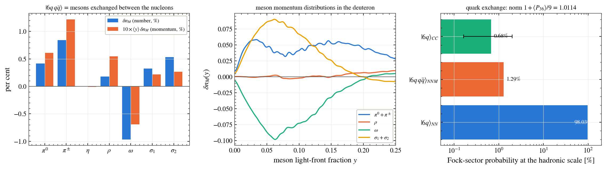
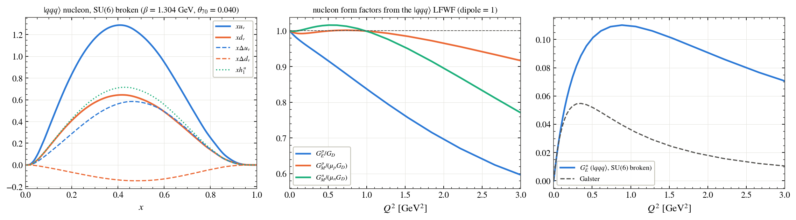
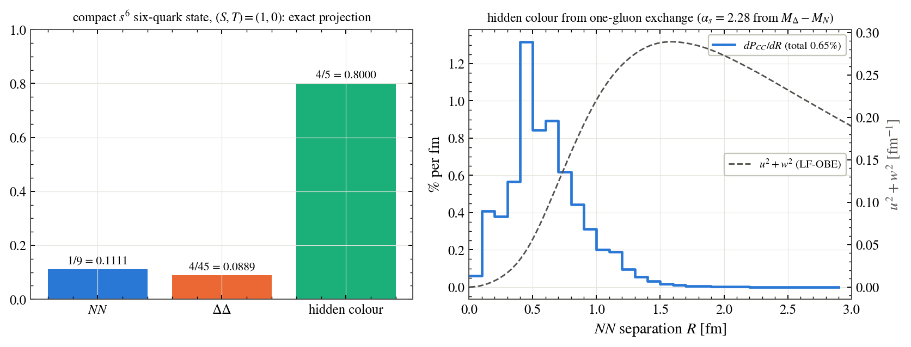
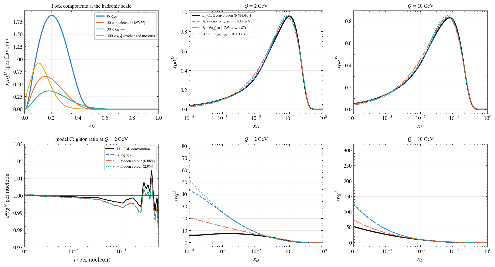
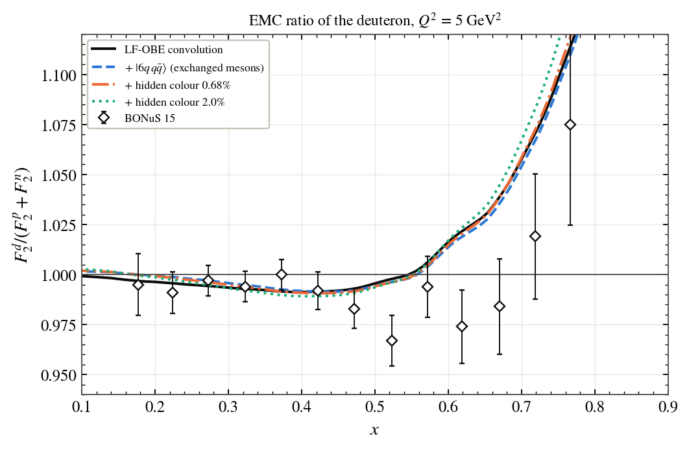
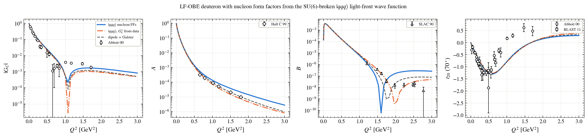

# My_Model_LFQCD_Fock_space

The deuteron as a light-front QCD Fock state |uuuddd⟩ + |6q g⟩ + |6q qq̄⟩, built sector by sector on top of My_Model_first_principle and a three-quark light-front nucleon.

**Probabilities of the Fock sectors and the mesons in flight between the nucleons**

**The SU(6)-broken three-quark nucleon: parton distributions and form factors**

**The |q g⟩ light-front amplitude reproduces the DGLAP splitting functions**

**Hidden colour: the six-quark colour algebra and its distance profile**

**Quark and gluon distributions built from the Fock states**

**EMC ratio of the deuteron from the Fock states against BONuS**

**A, B, t20 and G_C with quark-model nucleons**

