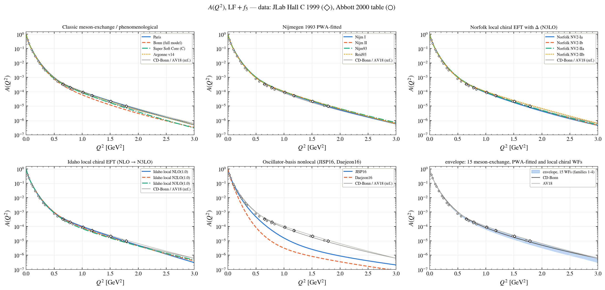
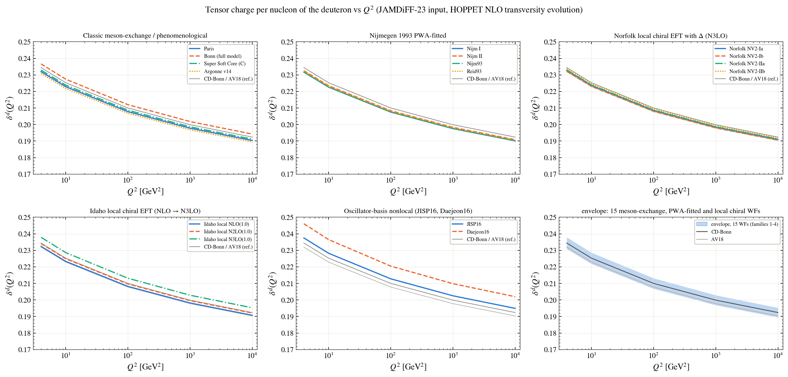

# The Deuteron on the Light Front

Satyajit Puhan · Institute of Physics, Academia Sinica, Taipei

*I am doing this for fun.*

> **Please note.** If you use any of the figures or the code, please cite this repository. If you follow research ethics, I will be happy to work with you. Contact: puhansatyajit@gmail.com · WhatsApp +886-919 479 591

The deuteron is the simplest nucleus, a proton and a neutron bound by 2.2 MeV, and it is a surprisingly rich system when you look at it
on the light front. Here I take every realistic deuteron wave function I could get hold of (19 of them, from the Super Soft Core of 1973 to the
Idaho chiral potentials of 2023), turn each into a relativistic light-front wave function, and compute everything that can be measured or
defined: elastic form factors, A, B and t20, the DIS structure functions F2, g1 and b1, parton distributions, the five unpolarised GPDs and the nine
TMDs at leading twist, transversity and the tensor charge, and the gluons after QCD evolution with HOPPET. Everything is compared with data.

On top of the survey there are two models of my own: a deuteron solved directly as an eigenstate of the light-front Hamiltonian of nucleons
and mesons (LF-OBE), and the deuteron as a light-front QCD Fock state |uuuddd⟩ + |6q g⟩ + |6q qq̄⟩, built sector by sector.

## What is here

| folder | content |
|---|---|
| [`figures/00_Cao-Gurjar-Karmanov-Li_light-front-framework`](figures/00_Cao-Gurjar-Karmanov-Li_light-front-framework) | the framework, reproduced with CD-Bonn and AV18 |
| [`figures/01_wave-function-survey`](figures/01_wave-function-survey) | one folder per wave function, named after its authors, plus all models side by side |
| [`figures/02_Puhan_LF-OBE-deuteron_2026`](figures/02_Puhan_LF-OBE-deuteron_2026) | the light-front one-boson-exchange deuteron |
| [`figures/03_Puhan_LF-QCD-Fock-space-deuteron_2026`](figures/03_Puhan_LF-QCD-Fock-space-deuteron_2026) | the deuteron as a light-front QCD Fock state |

### The wave functions

| folder | model | authors |
|---|---|---|
| [`01_Lacombe-Loiseau-Richard-VinhMau_Paris_1981`](figures/01_wave-function-survey/01_Lacombe-Loiseau-Richard-VinhMau_Paris_1981) | Paris | M. Lacombe, B. Loiseau, J.-M. Richard, R. Vinh Mau et al. |
| [`02_Machleidt-Holinde-Elster_Bonn-full-model_1987`](figures/01_wave-function-survey/02_Machleidt-Holinde-Elster_Bonn-full-model_1987) | Bonn (full model) | R. Machleidt, K. Holinde, Ch. Elster |
| [`03_Stoks-Klomp-Terheggen-deSwart_Nijm-I_1994`](figures/01_wave-function-survey/03_Stoks-Klomp-Terheggen-deSwart_Nijm-I_1994) | Nijm I | V. G. J. Stoks, R. A. M. Klomp, C. P. F. Terheggen, J. J. de Swart |
| [`04_Stoks-Klomp-Terheggen-deSwart_Nijm-II_1994`](figures/01_wave-function-survey/04_Stoks-Klomp-Terheggen-deSwart_Nijm-II_1994) | Nijm II | V. G. J. Stoks, R. A. M. Klomp, C. P. F. Terheggen, J. J. de Swart |
| [`05_Stoks-Klomp-Terheggen-deSwart_Nijm93_1994`](figures/01_wave-function-survey/05_Stoks-Klomp-Terheggen-deSwart_Nijm93_1994) | Nijm93 | V. G. J. Stoks, R. A. M. Klomp, C. P. F. Terheggen, J. J. de Swart |
| [`06_Stoks-Klomp-Terheggen-deSwart_Reid93_1994`](figures/01_wave-function-survey/06_Stoks-Klomp-Terheggen-deSwart_Reid93_1994) | Reid93 | V. G. J. Stoks, R. A. M. Klomp, C. P. F. Terheggen, J. J. de Swart |
| [`07_Wiringa-Smith-Ainsworth_Argonne-v14_1984`](figures/01_wave-function-survey/07_Wiringa-Smith-Ainsworth_Argonne-v14_1984) | Argonne v14 | R. B. Wiringa, R. A. Smith, T. L. Ainsworth |
| [`08_deTourreil-Sprung_Super-Soft-Core-C_1973`](figures/01_wave-function-survey/08_deTourreil-Sprung_Super-Soft-Core-C_1973) | Super Soft Core (C) | R. de Tourreil, D. W. L. Sprung |
| [`09_Piarulli-et-al_Norfolk-NV2-Ia_2016`](figures/01_wave-function-survey/09_Piarulli-et-al_Norfolk-NV2-Ia_2016) | Norfolk NV2-Ia | M. Piarulli et al. |
| [`10_Piarulli-et-al_Norfolk-NV2-Ib_2016`](figures/01_wave-function-survey/10_Piarulli-et-al_Norfolk-NV2-Ib_2016) | Norfolk NV2-Ib | M. Piarulli et al. |
| [`11_Piarulli-et-al_Norfolk-NV2-IIa_2016`](figures/01_wave-function-survey/11_Piarulli-et-al_Norfolk-NV2-IIa_2016) | Norfolk NV2-IIa | M. Piarulli et al. |
| [`12_Piarulli-et-al_Norfolk-NV2-IIb_2016`](figures/01_wave-function-survey/12_Piarulli-et-al_Norfolk-NV2-IIb_2016) | Norfolk NV2-IIb | M. Piarulli et al. |
| [`13_Saha-Entem-Machleidt-Nosyk_Idaho-local-NLO_2023`](figures/01_wave-function-survey/13_Saha-Entem-Machleidt-Nosyk_Idaho-local-NLO_2023) | Idaho local NLO(1.0) | S. K. Saha, D. R. Entem, R. Machleidt, Y. Nosyk |
| [`14_Saha-Entem-Machleidt-Nosyk_Idaho-local-N2LO_2023`](figures/01_wave-function-survey/14_Saha-Entem-Machleidt-Nosyk_Idaho-local-N2LO_2023) | Idaho local N2LO(1.0) | S. K. Saha, D. R. Entem, R. Machleidt, Y. Nosyk |
| [`15_Saha-Entem-Machleidt-Nosyk_Idaho-local-N3LO_2023`](figures/01_wave-function-survey/15_Saha-Entem-Machleidt-Nosyk_Idaho-local-N3LO_2023) | Idaho local N3LO(1.0) | S. K. Saha, D. R. Entem, R. Machleidt, Y. Nosyk |
| [`16_Shirokov-Vary-Mazur-Weber_JISP16_2007`](figures/01_wave-function-survey/16_Shirokov-Vary-Mazur-Weber_JISP16_2007) | JISP16 | A. M. Shirokov, J. P. Vary, A. I. Mazur, T. A. Weber |
| [`17_Shirokov-et-al_Daejeon16_2016`](figures/01_wave-function-survey/17_Shirokov-et-al_Daejeon16_2016) | Daejeon16 | A. M. Shirokov, I. J. Shin, Y. Kim, M. Sosonkina, P. Maris, J. P. Vary |
| [`18_Gutsche-Lyubovitskij-Schmidt-Vega_LF-holographic-six-quark_2016`](figures/01_wave-function-survey/18_Gutsche-Lyubovitskij-Schmidt-Vega_LF-holographic-six-quark_2016) | LF holographic 6q (twist 6) | T. Gutsche, V. E. Lyubovitskij, I. Schmidt, A. Vega |
| [`R1_Machleidt_CD-Bonn_2001`](figures/01_wave-function-survey/R1_Machleidt_CD-Bonn_2001) | CD-Bonn (reference) | R. Machleidt |
| [`R2_Wiringa-Stoks-Schiavilla_Argonne-v18_1995`](figures/01_wave-function-survey/R2_Wiringa-Stoks-Schiavilla_Argonne-v18_1995) | AV18 (reference) | R. B. Wiringa, V. G. J. Stoks, R. Schiavilla |

Each folder has its own README with the paper reference. The results in a folder follow from the assumptions of that model (its nuclear force and the data it was fitted to) together with one common light-front framework; differences between folders show how the assumptions of the models carry over into the observables.

## A few results

**A(Q²) for all wave functions against JLab Hall C**



**Tensor charge per nucleon of the deuteron against Q²**



**Fock content of the deuteron at the hadronic scale**


## Citing

```bibtex
@misc{Puhan:DeuteronLF,
    author       = "Puhan, Satyajit",
    title        = "{The Deuteron on the Light Front}",
    year         = "2026",
    howpublished = "\url{https://github.com/satyajitpuhan/Deuteron-Light-Front}"
}
```

---

The code is kept private for now. It is available on request.

© 2026 Satyajit Puhan. All rights reserved: the figures may not be reused without permission.
