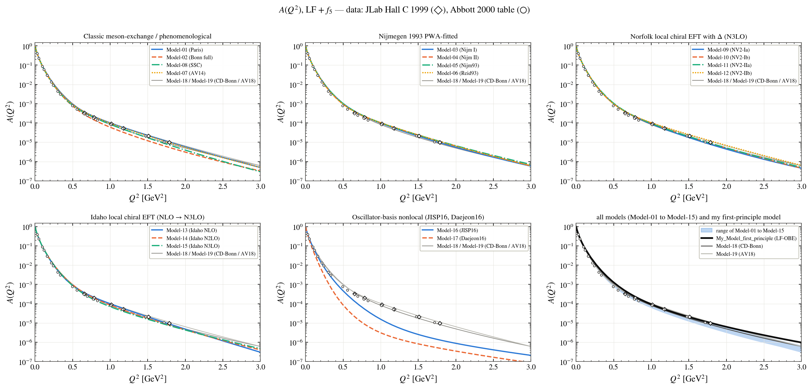
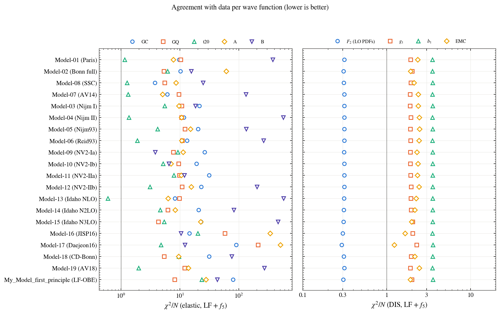
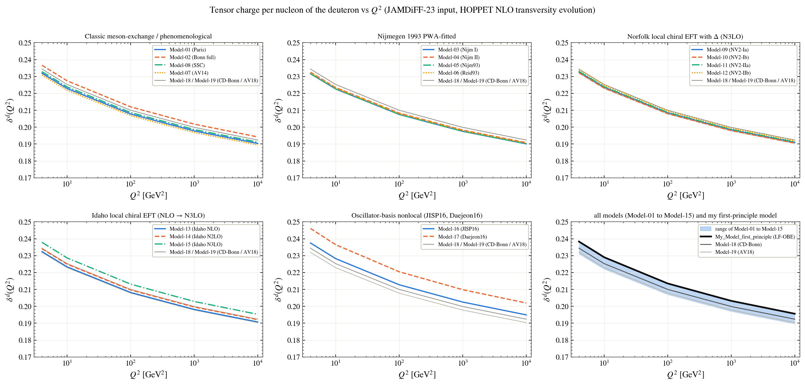

# The Deuteron on the Light Front

Satyajit Puhan · Institute of Physics, Academia Sinica, Taipei

*I am doing this for fun.*

> **Please note.** If you use any of the figures or the code, please cite this repository. If you follow research ethics, I will be happy to work with you and to share the code along with the notes. Contact: puhansatyajit@gmail.com · WhatsApp +886-919 479 591

The deuteron is the simplest nucleus, a proton and a neutron bound by 2.2 MeV. Here I take twenty deuteron models from the literature, call them Model-01 to Model-20, turn each into a relativistic light-front wave function, and compute everything that can be measured or defined: the elastic form factors, A, B and t20, the structure functions F2, g1 and b1, parton distributions, the five unpolarised GPDs and the nine TMDs at leading twist, transversity and the tensor charge, and the gluons after QCD evolution. Every result is compared with the data.

Next to them are my own two models: **My_Model_first_principle**, a deuteron solved directly from the light-front Hamiltonian of nucleons and mesons, and **My_Model_LFQCD_Fock_space**, the deuteron built as a light-front QCD Fock state |uuuddd⟩ + |6q g⟩ + |6q qq̄⟩.

<a name="the-models"></a>
## The models

| name | model | authors | reference |
|---|---|---|---|
| Model-01 | Paris | M. Lacombe, B. Loiseau, J.-M. Richard, R. Vinh Mau et al. | PRC 21, 861 (1980); PLB 101, 139 (1981) |
| Model-02 | Bonn (full model) | R. Machleidt, K. Holinde, Ch. Elster | Phys. Rep. 149, 1 (1987) |
| Model-03 | Nijm I | V. G. J. Stoks, R. A. M. Klomp, C. P. F. Terheggen, J. J. de Swart | PRC 49, 2950 (1994) |
| Model-04 | Nijm II | V. G. J. Stoks, R. A. M. Klomp, C. P. F. Terheggen, J. J. de Swart | PRC 49, 2950 (1994) |
| Model-05 | Nijm93 | V. G. J. Stoks, R. A. M. Klomp, C. P. F. Terheggen, J. J. de Swart | PRC 49, 2950 (1994) |
| Model-06 | Reid93 | V. G. J. Stoks, R. A. M. Klomp, C. P. F. Terheggen, J. J. de Swart | PRC 49, 2950 (1994) |
| Model-07 | Argonne v14 | R. B. Wiringa, R. A. Smith, T. L. Ainsworth | PRC 29, 1207 (1984) |
| Model-08 | Super Soft Core (C) | R. de Tourreil, D. W. L. Sprung | NPA 201, 193 (1973) |
| Model-09 | Norfolk NV2-Ia | M. Piarulli et al. | PRC 94, 054007 (2016) |
| Model-10 | Norfolk NV2-Ib | M. Piarulli et al. | PRC 94, 054007 (2016) |
| Model-11 | Norfolk NV2-IIa | M. Piarulli et al. | PRC 94, 054007 (2016) |
| Model-12 | Norfolk NV2-IIb | M. Piarulli et al. | PRC 94, 054007 (2016) |
| Model-13 | Idaho local chiral NLO | S. K. Saha, D. R. Entem, R. Machleidt, Y. Nosyk | PRC 107, 034002 (2023) |
| Model-14 | Idaho local chiral N2LO | S. K. Saha, D. R. Entem, R. Machleidt, Y. Nosyk | PRC 107, 034002 (2023) |
| Model-15 | Idaho local chiral N3LO | S. K. Saha, D. R. Entem, R. Machleidt, Y. Nosyk | PRC 107, 034002 (2023) |
| Model-16 | JISP16 | A. M. Shirokov, J. P. Vary, A. I. Mazur, T. A. Weber | PLB 644, 33 (2007) |
| Model-17 | Daejeon16 | A. M. Shirokov, I. J. Shin, Y. Kim, M. Sosonkina, P. Maris, J. P. Vary | PLB 761, 87 (2016) |
| Model-18 | CD-Bonn | R. Machleidt | PRC 63, 024001 (2001) |
| Model-19 | Argonne v18 | R. B. Wiringa, V. G. J. Stoks, R. Schiavilla | PRC 51, 38 (1995) |
| Model-20 | Light-front holographic six-quark | T. Gutsche, V. E. Lyubovitskij, I. Schmidt, A. Vega | PRD 91, 114001 (2015); PRD 94, 114030 (2016) |
| **My_Model_first_principle** | the deuteron solved as an eigenstate of the light-front Hamiltonian of nucleons and seven mesons (π⁰, π±, η, ρ, ω, σ₁, σ₂, CD-Bonn couplings), Fock space \|NN⟩ + \|NN meson⟩, one parameter fixed by the binding energy | S. Puhan | this work |
| **My_Model_LFQCD_Fock_space** | the deuteron as a light-front QCD Fock state \|uuuddd⟩ + \|6q g⟩ + \|6q qq̄⟩, built sector by sector on top of My_Model_first_principle and a three-quark light-front nucleon | S. Puhan | this work |

The results of each model follow from that model's own assumptions (its nuclear force and the data it was fitted to), placed in one common framework: the light-front Bakamjian–Thomas construction with Melosh-rotated nucleon spins and the relativistic Carbonell–Karmanov component f5, the impulse approximation, dipole + Galster nucleon form factors, NNPDF3.1, NNPDFpol1.1 and JAM for the nucleon partons, and HOPPET for the QCD evolution. The data were never fitted.

## Figures

Only comparisons of all the models are shown, one folder per topic:

- [Wave functions](Figures/01_Wave_Functions)
- [Static properties and agreement with data](Figures/02_Static_Properties_and_Agreement_with_Data)
- [Elastic electron–deuteron scattering](Figures/03_Elastic_Scattering)
- [Nucleon momentum distributions in the deuteron](Figures/04_Nucleon_Momentum_Distributions)
- [Deep inelastic structure functions](Figures/05_DIS_Structure_Functions)
- [Parton distributions](Figures/06_Parton_Distributions)
- [Transverse-momentum distributions (TMDs)](Figures/07_TMDs)
- [Generalised parton distributions (GPDs)](Figures/08_GPDs)
- [Transversity and tensor charge](Figures/09_Transversity)
- [My_Model_LFQCD_Fock_space](Figures/10_My_Model_LFQCD_Fock_space)

**A(Q²): all models against JLab Hall C**



**Agreement with every data set**



**Tensor charge per nucleon against Q²**



## Data

- [Experimental_Data](Experimental_Data): every data set used, as CSV files, with references.
- [Wave_Functions](Wave_Functions): u(r) and w(r) of every model and of My_Model_first_principle.

## Citing

```bibtex
@misc{Puhan:DeuteronLF,
    author       = "Puhan, Satyajit",
    title        = "{The Deuteron on the Light Front}",
    year         = "2026",
    howpublished = "\url{https://github.com/satyajitpuhan/Deuteron-Light-Front}"
}
```

---

The code is kept private for now. I will be happy to share it along with the notes.

© 2026 Satyajit Puhan. All rights reserved: the figures may not be reused without permission.
