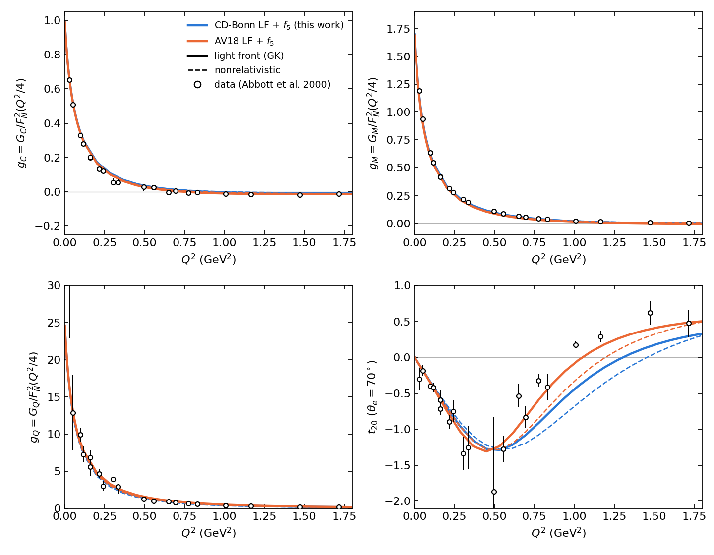
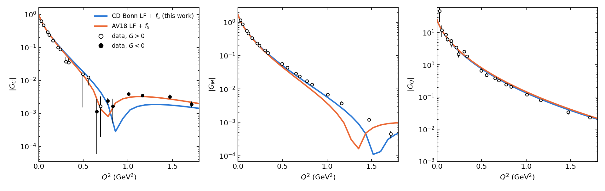
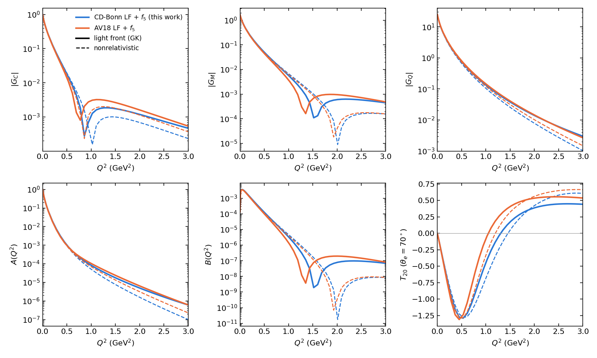
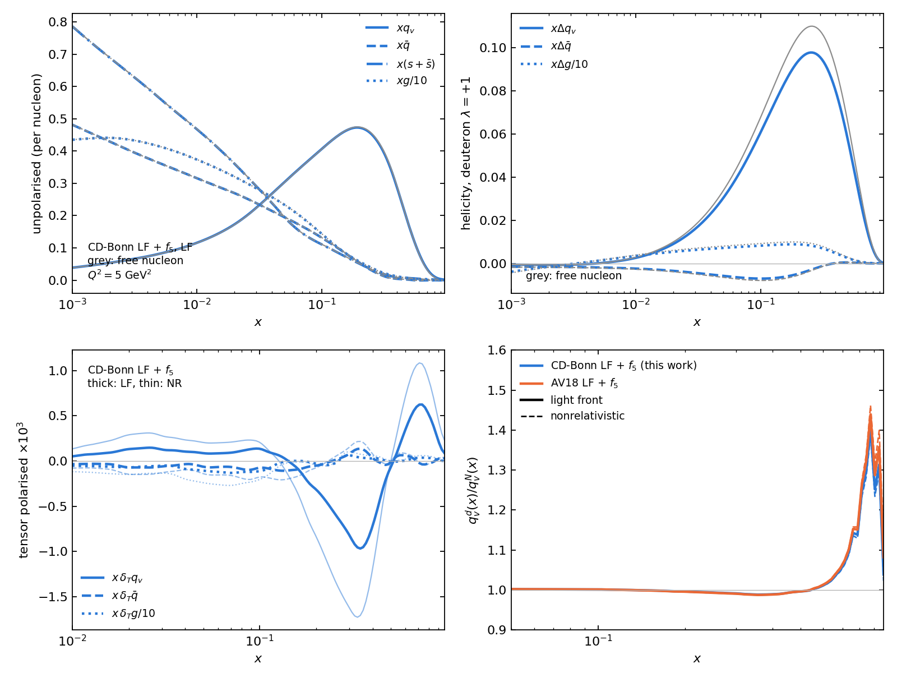
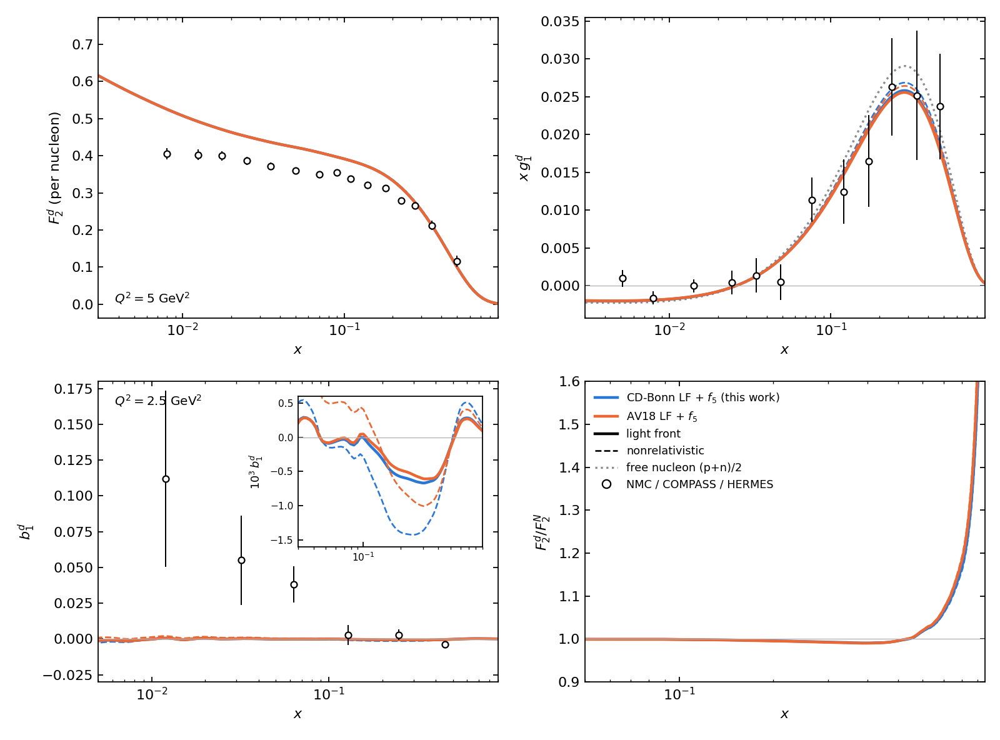
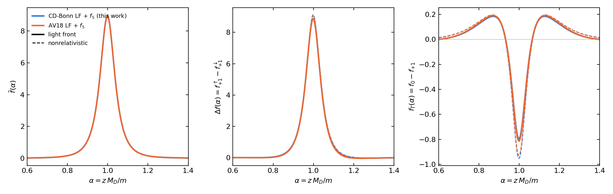
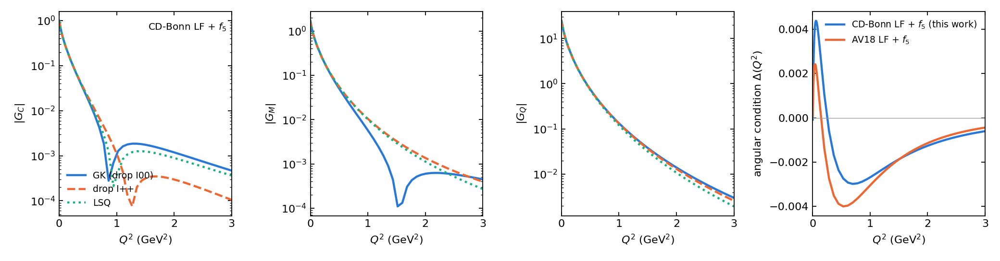
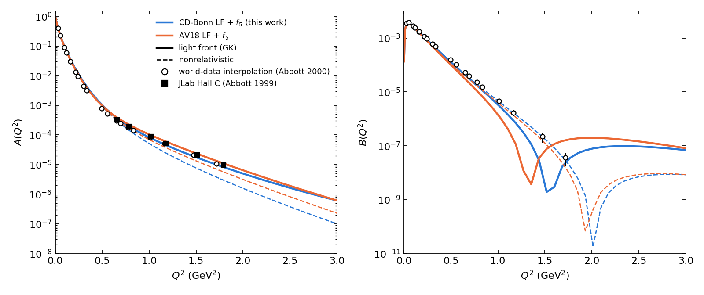
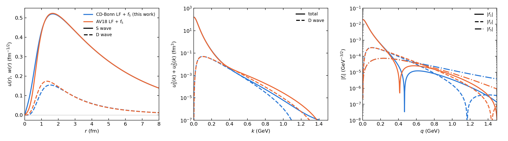

# The light-front framework (CD-Bonn and AV18)

**Framework:** J. Carbonell, V. A. Karmanov, NPA 581, 625 (1995); J. Carbonell, B. Desplanques, V. A. Karmanov, J.-F. Mathiot, Phys. Rep. 300, 215 (1998); longitudinal momentum distributions as in Cao, Gurjar, Karmanov, Li, arXiv:2610.06483.

These figures reproduce the framework with the CD-Bonn and AV18 wave functions. They follow from the assumptions of those papers: the Carbonell–Karmanov representation with the f5 component from one-pion exchange, and the impulse approximation.

> **Please note.** If you use any of the figures or the code, please cite this repository. If you follow research ethics, I will be happy to work with you and to share the code along with the notes. Contact: puhansatyajit@gmail.com · WhatsApp +886-919 479 591
