# Daejeon16

**Authors of the wave function:** A. M. Shirokov, I. J. Shin, Y. Kim, M. Sosonkina, P. Maris, J. P. Vary  
**Reference:** A. M. Shirokov et al., PLB 761, 87 (2016)

**What kind of model it is:** SRG-evolved (1.5 fm^-1) Idaho N3LO + PETs, nonlocal, soft. D-state probability 2.00%.

## Please read this first

These figures are the results that follow from the assumptions of this model: the nuclear force of A. M. Shirokov, I. J. Shin, Y. Kim, M. Sosonkina, P. Maris, J. P. Vary, the data it was fitted to, and the deuteron wave function it produces. All observables shown here are computed from this model's own deuteron wave function, inside one common framework: the Bakamjian–Thomas light-front construction with Melosh-rotated nucleon spins, plus the relativistic Carbonell–Karmanov component f5 generated by one-pion exchange (the same πNN vertex for every model); the impulse approximation (no meson-exchange currents); dipole + Galster nucleon form factors; NNPDF3.1, NNPDFpol1.1 and JAM transversity for the nucleon partons; HOPPET for the QCD evolution. The data points were never fitted. Differences between the folders therefore show how the different assumptions of the different models propagate into the observables; they are not new fits.

## Figures

**S and D waves in coordinate and momentum space, and the light-front components f1, f2, f5**

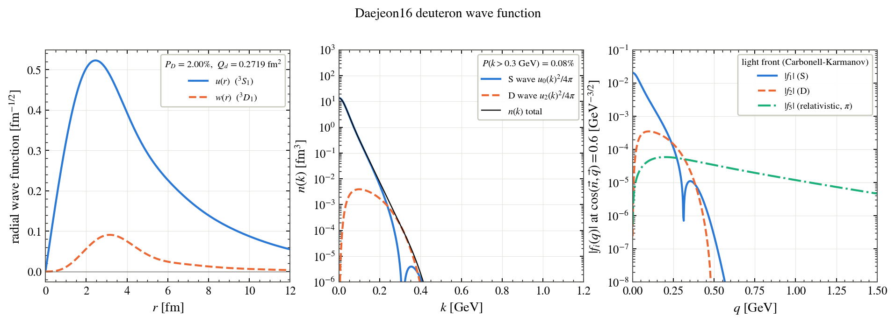

**charge, magnetic and quadrupole form factors G_C, G_M, G_Q against data**

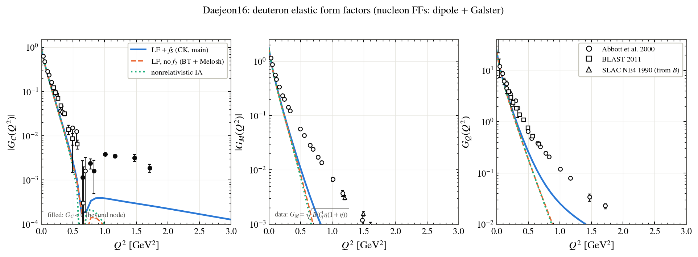

**structure functions A(Q²), B(Q²) and the tensor polarisation t20 against data**

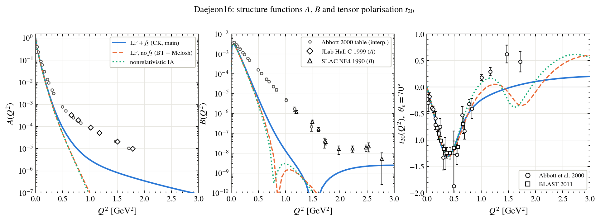

**light-cone momentum distributions of the nucleon: f1, g1L, f1LL**

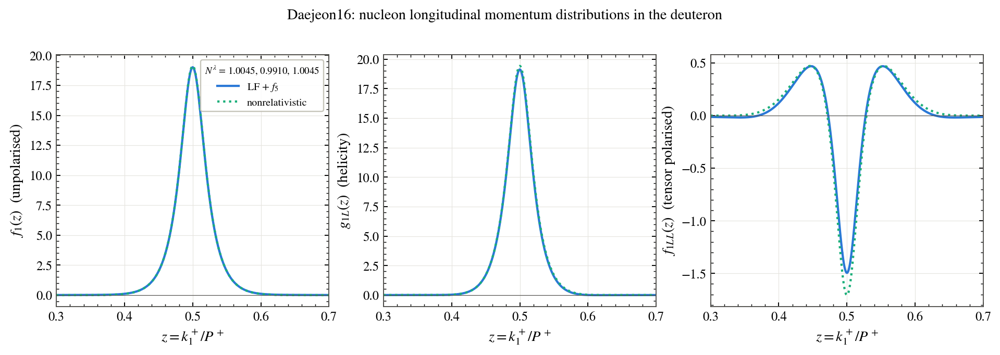

**F2, g1, b1 of the deuteron and the EMC ratio against data**

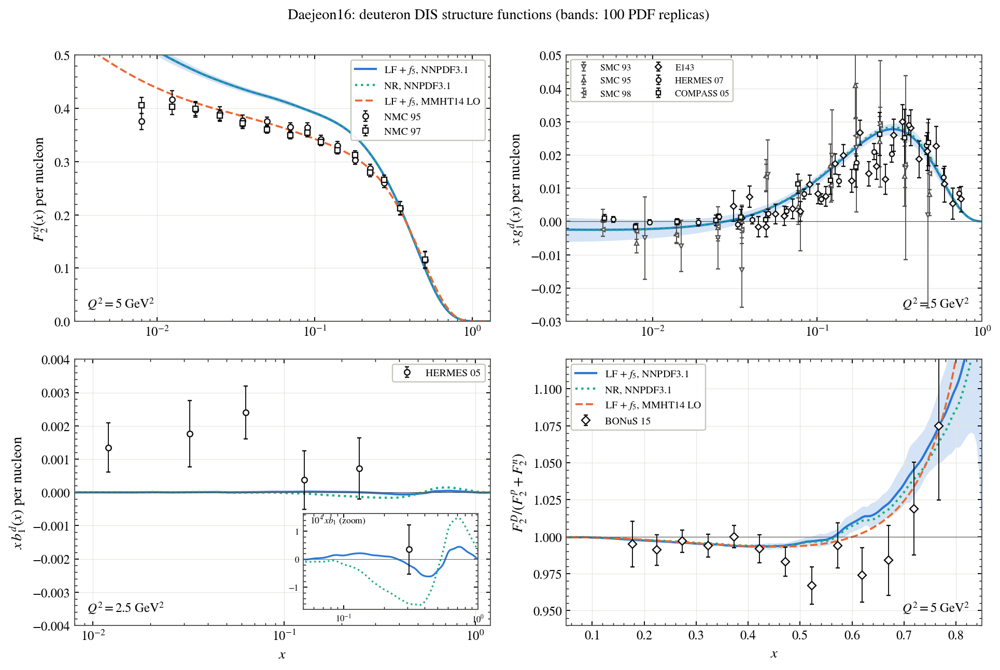

**quark distributions of the deuteron (unpolarised, helicity, tensor polarised)**

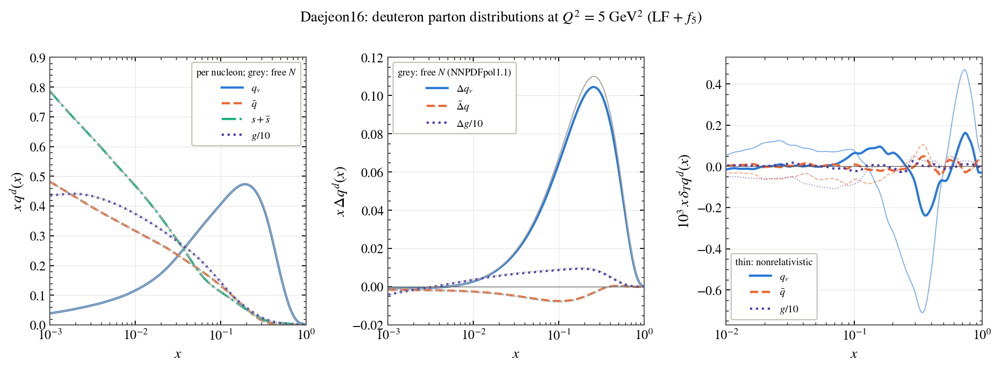

**transverse-momentum distributions of the nucleon in the deuteron**

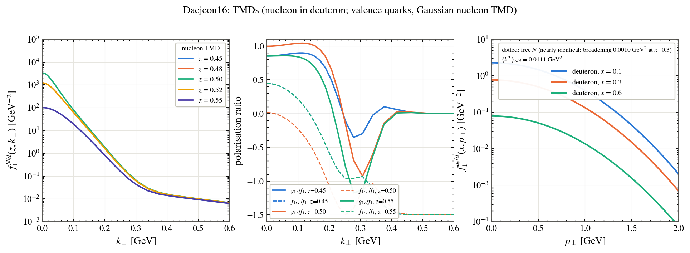

**generalised parton distributions at zero skewness and the transverse density**

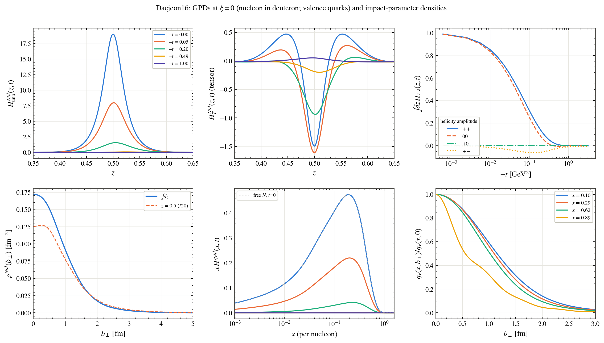

**the five unpolarised GPDs H1–H5, nucleon level, 3D**

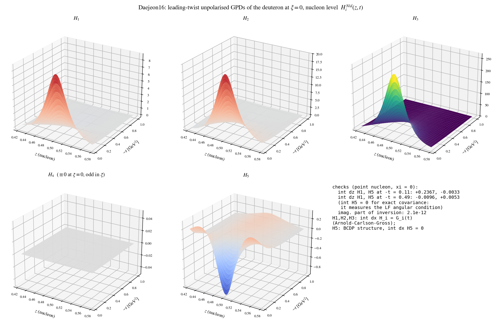

**the five unpolarised GPDs H1–H5, quark level, 3D**

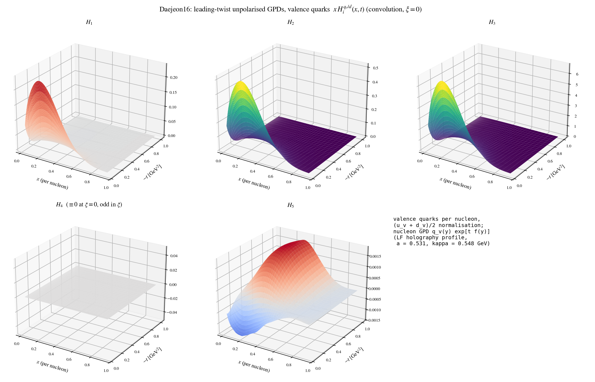

**the nine leading-twist T-even TMDs, 3D**

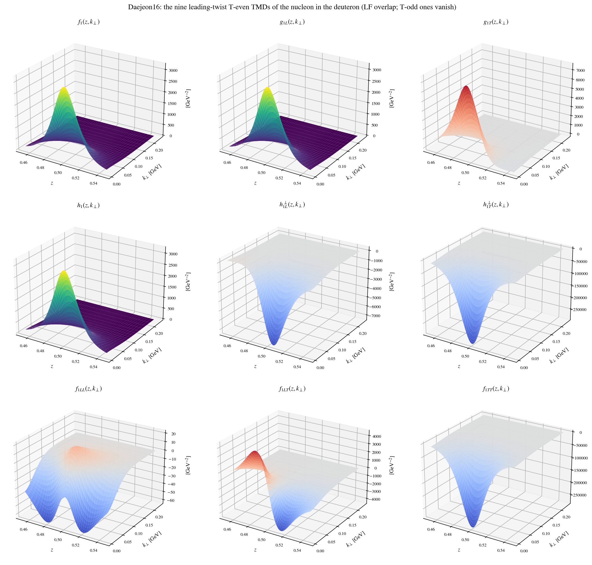

**transversity of the nucleon and of the quarks in the deuteron, tensor charge vs Q²**

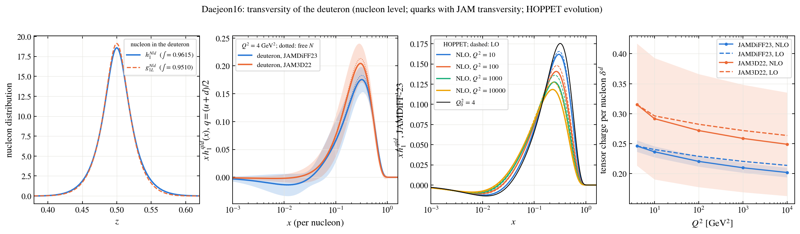

**QCD evolution (HOPPET) of quarks and gluons: g, Δg, δ_T g**

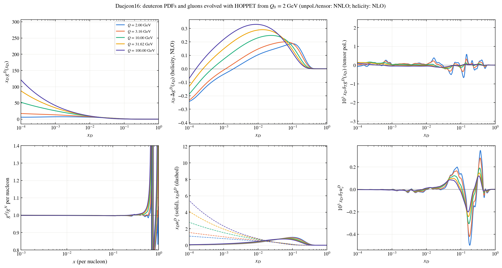

## χ²/N against data

```
LFf5: GC Abbott00: 34.98 (N=20) | GC BLAST11: 211.34 (N=9) | GQ Abbott00: 119.20 (N=20) | GQ BLAST11: 417.46 (N=9) | t20 Abbott00: 6.72 (N=20) | t20 BLAST11: 0.50 (N=9) | A HallC99: 507.27 (N=6) | B SLAC90: 12.10 (N=9)
LF: GC Abbott00: 40.87 (N=20) | GC BLAST11: 236.78 (N=9) | GQ Abbott00: 167.53 (N=20) | GQ BLAST11: 573.73 (N=9) | t20 Abbott00: 4.37 (N=20) | t20 BLAST11: 0.20 (N=9) | A HallC99: 549.84 (N=6) | B SLAC90: 12.72 (N=9)
NR: GC Abbott00: 39.50 (N=20) | GC BLAST11: 232.13 (N=9) | GQ Abbott00: 167.93 (N=20) | GQ BLAST11: 574.53 (N=9) | t20 Abbott00: 3.17 (N=20) | t20 BLAST11: 0.42 (N=9) | A HallC99: 550.24 (N=6) | B SLAC90: 12.72 (N=9)
LF_F2: NMC 95: 14.91 (N=7) | NMC 97: 18.67 (N=7)
LF_g1: SMC 93: 0.45 (N=11) | SMC 95: 1.46 (N=12) | SMC 98: 1.31 (N=13) | E143: 2.25 (N=28) | HERMES 07: 4.96 (N=19) | COMPASS 05: 1.68 (N=12)
LF_b1: HERMES 05: 3.56 (N=6)
LF_EMC: BONuS 15: 1.24 (N=13)
LF_F2_LO: NMC 95: 0.22 (N=7) | NMC 97: 0.36 (N=7)
LF_EMC_LO: BONuS 15: 0.85 (N=13)
NR_F2: NMC 95: 14.98 (N=7) | NMC 97: 18.75 (N=7)
NR_g1: SMC 93: 0.45 (N=11) | SMC 95: 1.48 (N=12) | SMC 98: 1.35 (N=13) | E143: 2.39 (N=28) | HERMES 07: 5.32 (N=19) | COMPASS 05: 1.74 (N=12)
NR_b1: HERMES 05: 3.58 (N=6)
NR_EMC: BONuS 15: 1.11 (N=13)
NR_F2_LO: NMC 95: 0.22 (N=7) | NMC 97: 0.36 (N=7)
NR_EMC_LO: BONuS 15: 0.80 (N=13)
```

---
© 2026 Satyajit Puhan. Figures may not be reused without permission.
