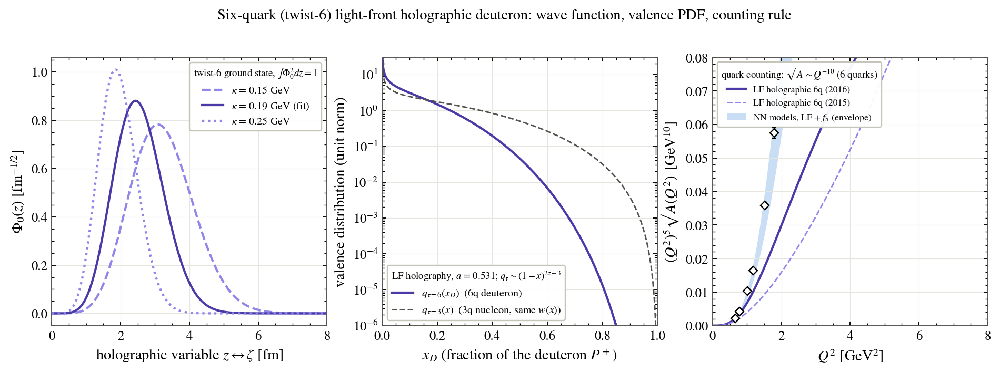
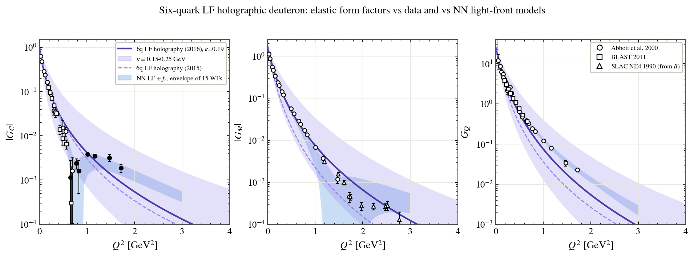
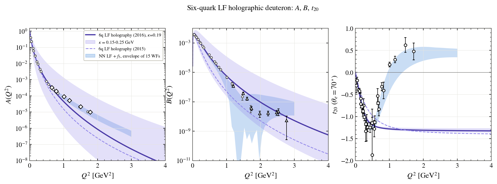
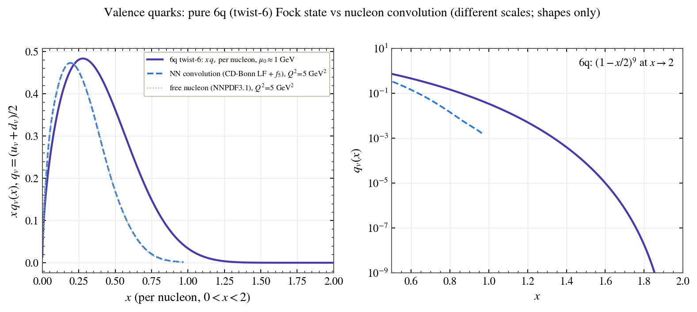

# LF holographic 6q (twist 6)

**Authors of the wave function:** T. Gutsche, V. E. Lyubovitskij, I. Schmidt, A. Vega  
**Reference:** T. Gutsche, V. E. Lyubovitskij, I. Schmidt, PRD 94, 114030 (2016); G. F. de Teramond et al., PRL 120, 182001 (2018)

**What kind of model it is:** soft-wall AdS/QCD, light-front holography: deuteron as a 6-parton (twist-6) Fock state.

> **Please note.** If you use any of the figures or the code, please cite this repository. If you follow research ethics, I will be happy to work with you. Contact: puhansatyajit@gmail.com · WhatsApp +886-919 479 591

## Please read this first

These figures are the results that follow from the assumptions of this model: the nuclear force of T. Gutsche, V. E. Lyubovitskij, I. Schmidt, A. Vega, the data it was fitted to, and the deuteron wave function it produces. All observables shown here are computed from this model's own deuteron wave function, inside one common framework: the Bakamjian–Thomas light-front construction with Melosh-rotated nucleon spins, plus the relativistic Carbonell–Karmanov component f5 generated by one-pion exchange (the same πNN vertex for every model); the impulse approximation (no meson-exchange currents); dipole + Galster nucleon form factors; NNPDF3.1, NNPDFpol1.1 and JAM transversity for the nucleon partons; HOPPET for the QCD evolution. The data points were never fitted. Differences between the folders therefore show how the different assumptions of the different models propagate into the observables; they are not new fits.

## Figures

**01_wavefunction_counting_rule**

**charge, magnetic and quadrupole form factors G_C, G_M, G_Q against data**

**structure functions A(Q²), B(Q²) and the tensor polarisation t20 against data**

**04_valence_PDF**

---
© 2026 Satyajit Puhan. Figures may not be reused without permission.
