# A light-front one-boson-exchange deuteron (this work)

The deuteron solved as an eigenstate of the light-front Hamiltonian of nucleons and seven mesons (π⁰, π±, η, ρ, ω, σ₁, σ₂) with the CD-Bonn couplings (R. Machleidt, PRC 63, 024001 (2001)), in the Fock space |NN⟩ + |NN meson⟩. One parameter (the σ strength) is fixed by the binding energy.

These results follow from the assumptions of this model: one meson in flight, the CD-Bonn meson–nucleon couplings and form factors, an invariant-mass cutoff of 15 fm⁻¹, and the impulse approximation for the observables. The relativistic spin-singlet component (1.62%) comes out of the dynamics. χ²/N = 37 for 102 elastic data points.

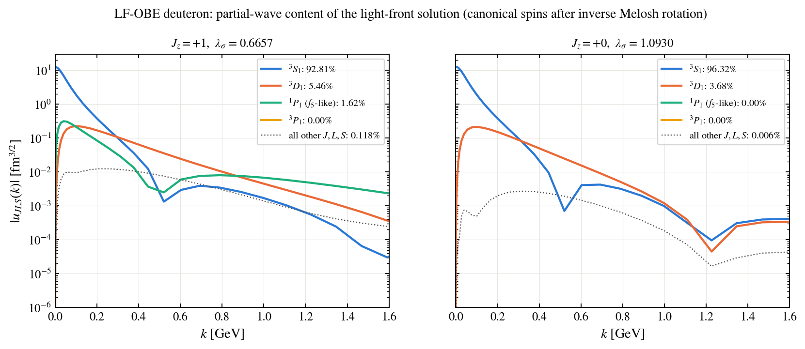

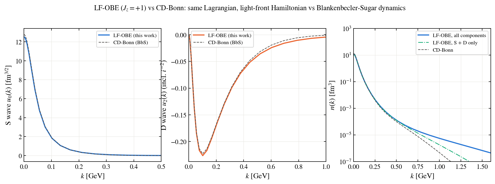

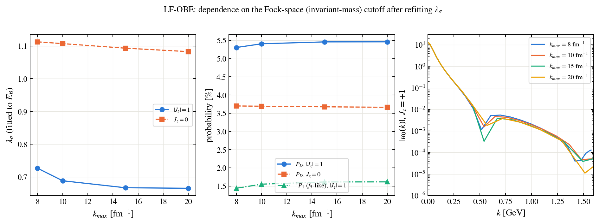

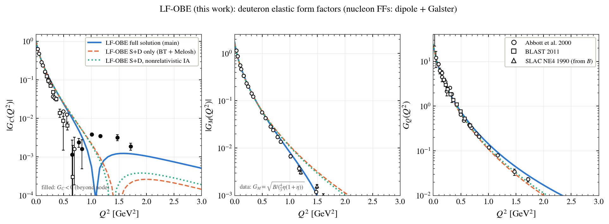

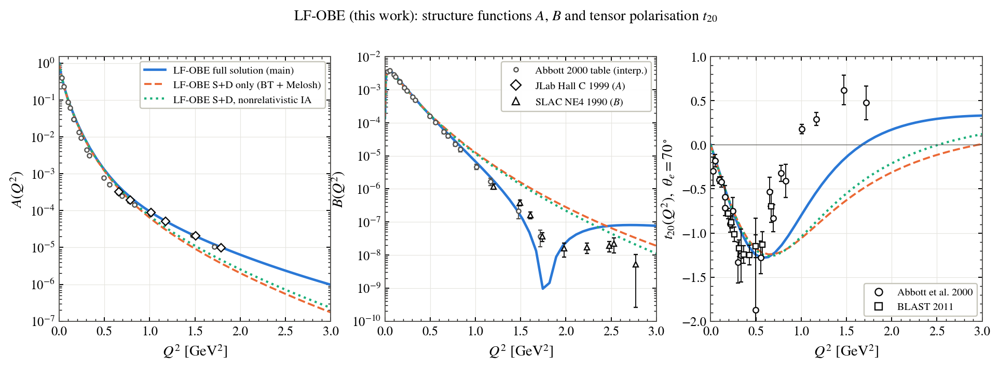

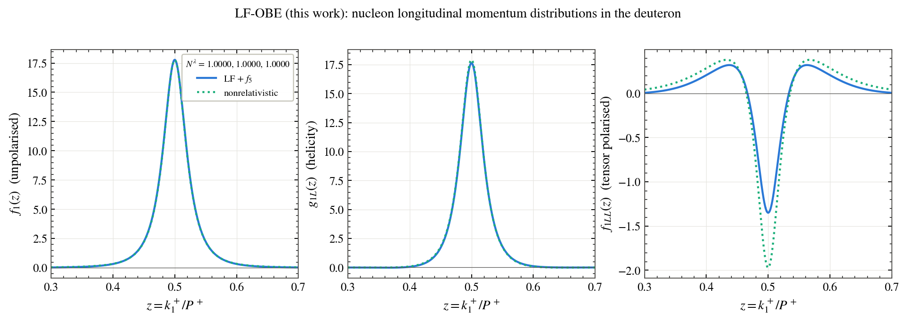

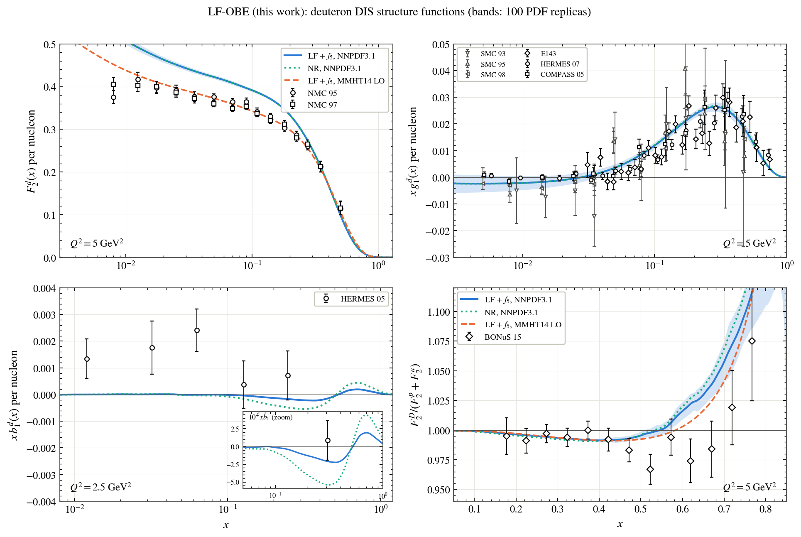

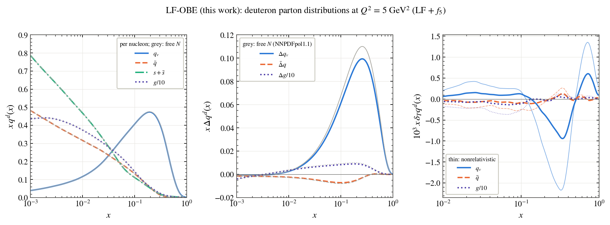

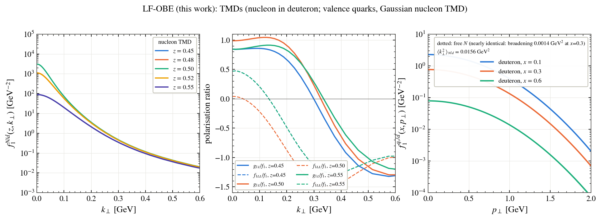

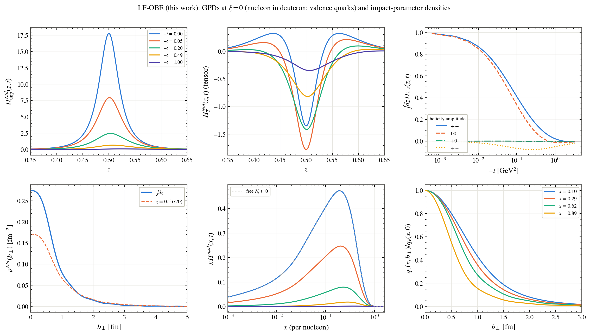

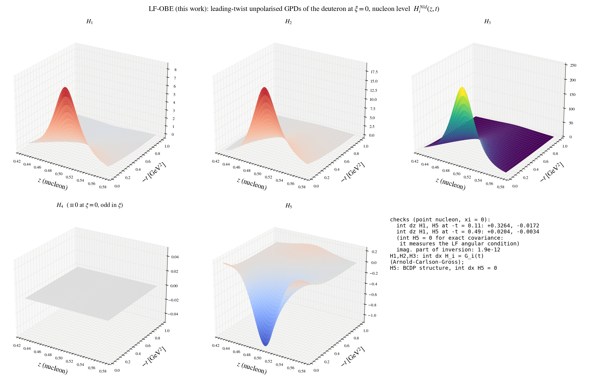

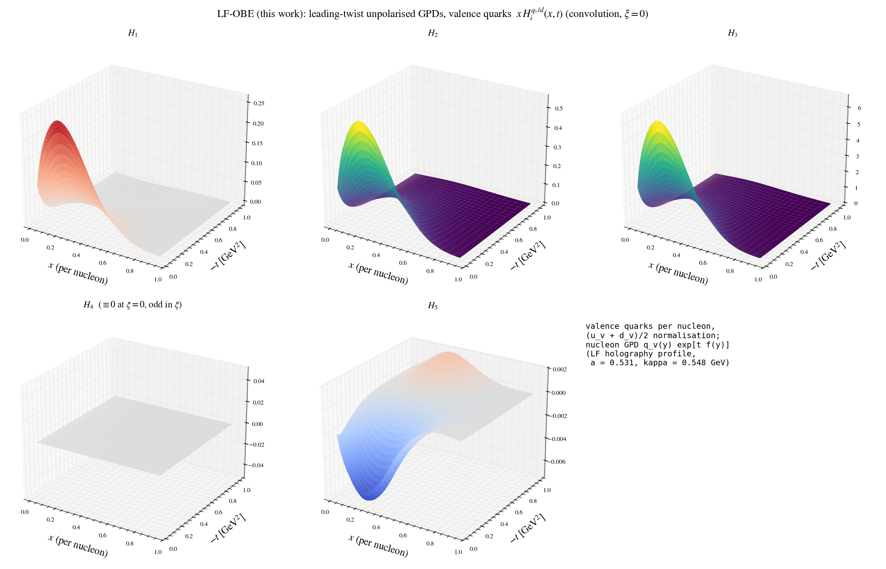

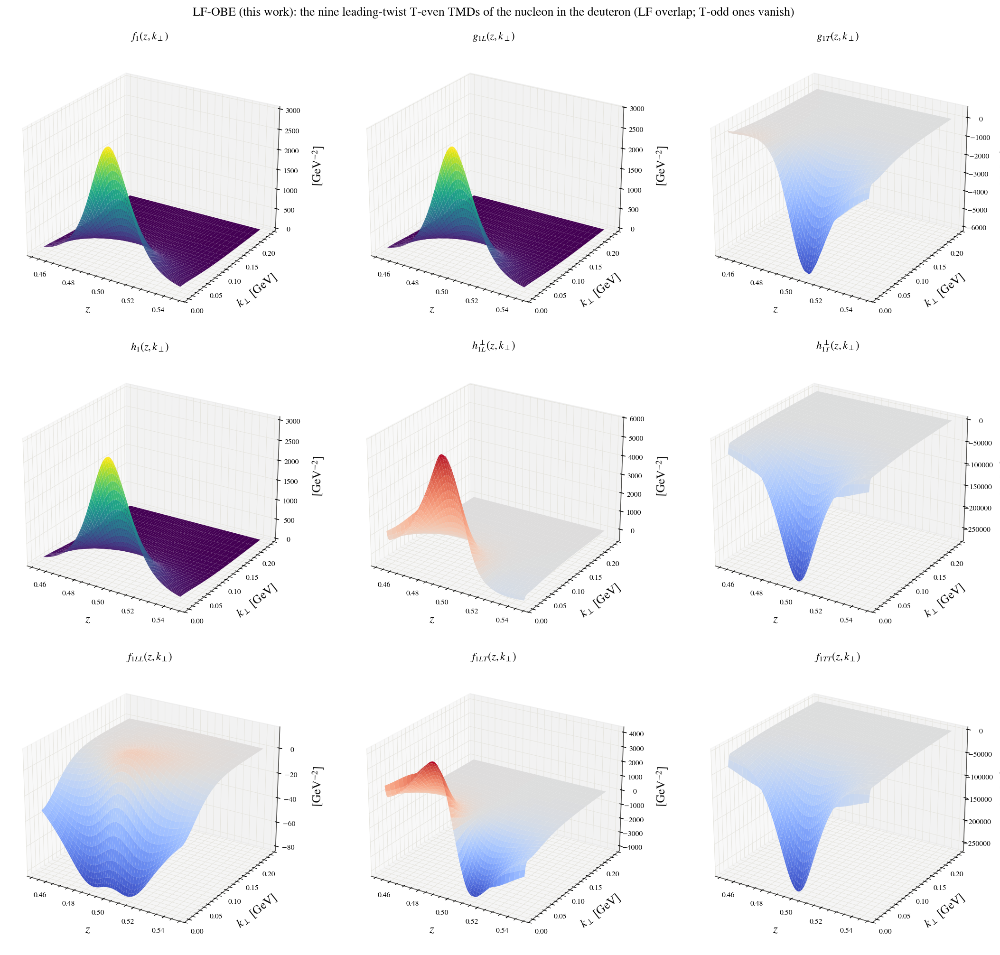

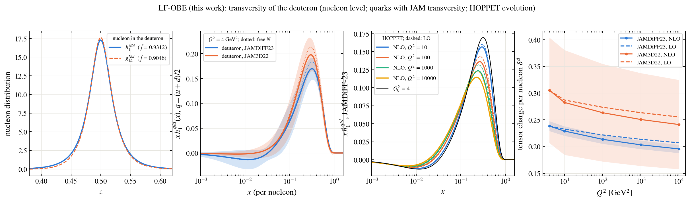

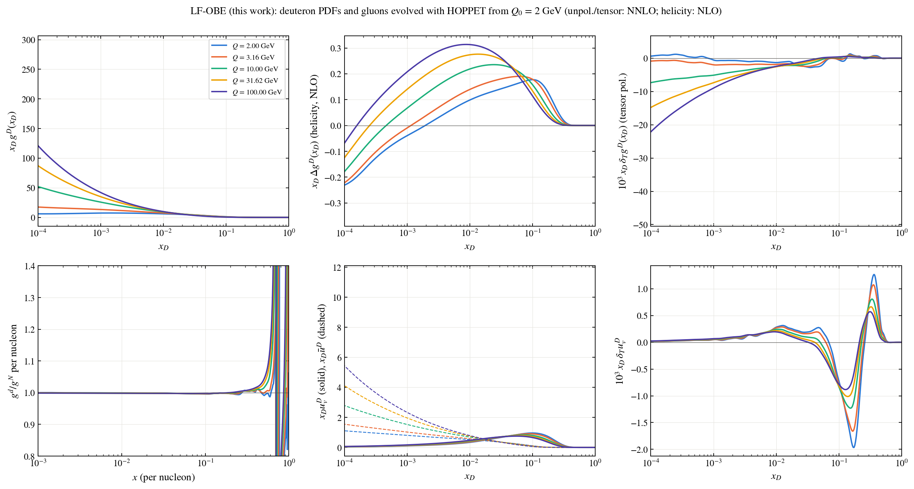

> **Please note.** If you use any of the figures or the code, please cite this repository. If you follow research ethics, I will be happy to work with you and to share the code along with the notes. Contact: puhansatyajit@gmail.com · WhatsApp +886-919 479 591
