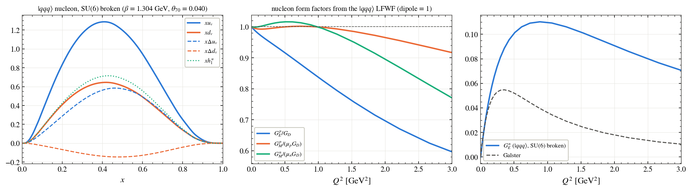
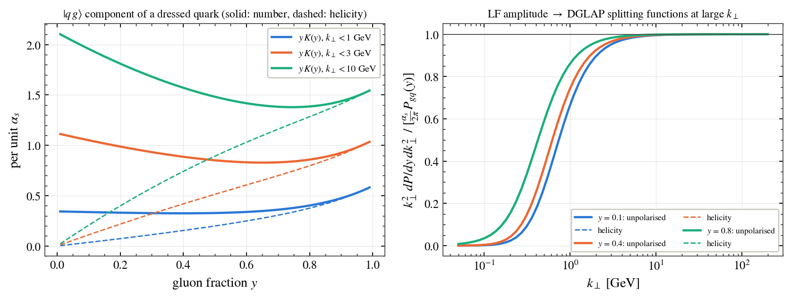
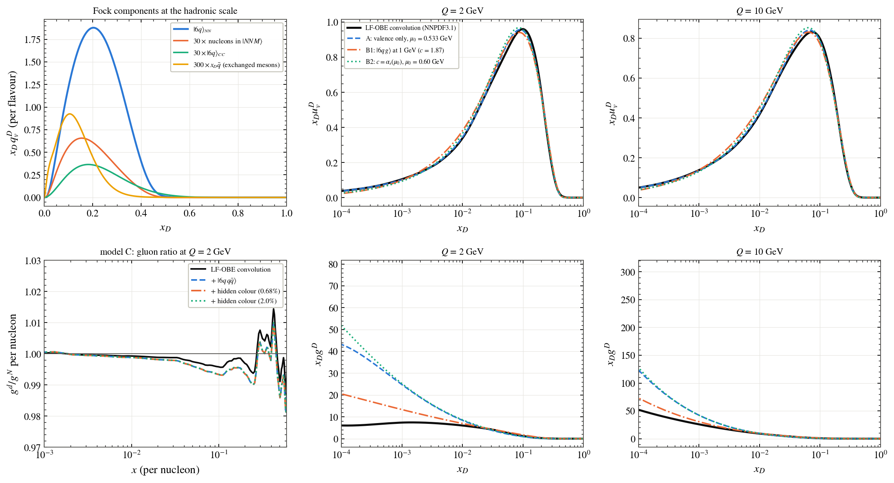
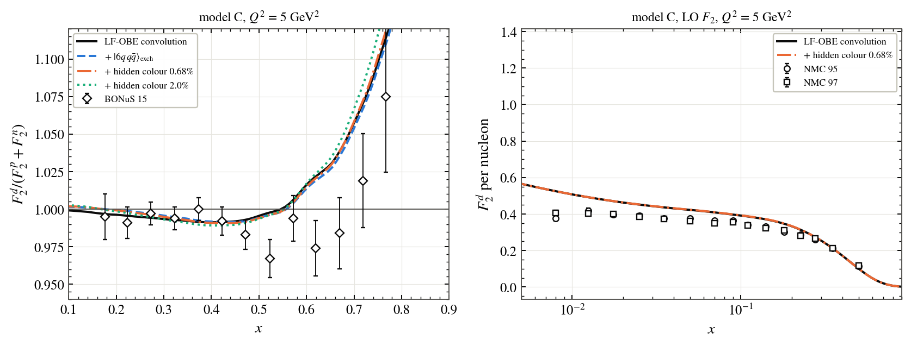
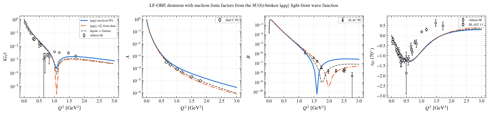

# The deuteron as a light-front QCD Fock state (this work)

|uuuddd⟩ (two three-quark nucleons, quark exchange and hidden colour) + |6q qq̄⟩ (mesons in flight between the nucleons) + |6q g⟩ (from the light-front QCD quark–gluon vertex).

These results follow from the assumptions of this model: a three-quark light-front nucleon (power-law wave function, Melosh-rotated spins, SU(6) broken by a mixed-symmetry admixture, quark anomalous moments and quark sizes), the LF-OBE relative motion, one-gluon exchange for hidden colour, and first-order (exponentiated) gluon emission.

> **Please note.** If you use any of the figures or the code, please cite this repository. If you follow research ethics, I will be happy to work with you. Contact: puhansatyajit@gmail.com · WhatsApp +886-919 479 591
